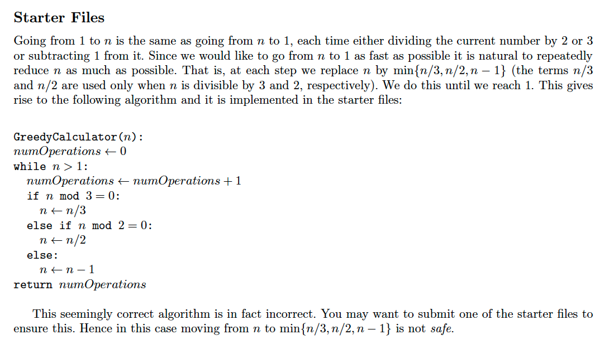

# 2. Primitive Calculator

## Problem



## Solutions
* [C++](#cpp)
* [Python3](#python3)

### CPP
```cpp
    #include <iostream>
    #include <sstream>
    #include <iterator>
    #include <algorithm>
    #include <queue>
    #include <unordered_map>
    #include <cassert>

    using namespace std;

    using Type = int;
    using Memo = unordered_map< Type,Type >;
    using Collection = deque< Type >;

    const auto INF = static_cast< Type >( 1e6+1 );

    Collection reconstruct( Type N, Memo& memo, Collection A={} ){
        while( 0 < N ){
            A.push_front( N );
            auto prev3 = ( N % 3 == 0 && memo.find( N / 3 ) != memo.end() )? memo[ N / 3 ] : INF;
            auto prev2 = ( N % 2 == 0 && memo.find( N / 2 ) != memo.end() )? memo[ N / 2 ] : INF;
            auto prev1 = ( N - 1 >= 0 && memo.find( N - 1 ) != memo.end() )? memo[ N - 1 ] : INF;
            auto prev = min({ prev3, prev2, prev1 });
            if(      prev == prev3 ) N /= 3;
            else if( prev == prev2 ) N /= 2;
            else if( prev == prev1 ) N -= 1;
        }
        return A;
    }

    namespace TopDown {
        template< typename Type >
        class Solution {
        public:
            Collection minOps( Type N, Memo memo={}, Collection A={} ){
                go( N, memo );
                return reconstruct( N, memo );
            }
        private:
            Type go( Type N, Memo& memo, Type ans=INF ){
                if( N < 2 )
                    memo[ N ] = 0;
                if( memo.find( N ) != memo.end() )
                    return memo[ N ];
                if( N % 3 == 0 ) ans = min( ans, 1 + go( N / 3, memo ));
                if( N % 2 == 0 ) ans = min( ans, 1 + go( N / 2, memo ));
                return memo[ N ] = min( ans, 1 + go( N - 1, memo ));
            }
        };
    }
    namespace BottomUp {
        template< typename Type >
        class Solution {
        public:
            Collection minOps( Type N, Memo memo={{ 1,0 }} ){
                Collection dp( N+1, INF );
                dp[ 1 ] = 0;
                for( auto i{ 2 }; i <= N; ++i ){
                    if( i % 3 == 0 ) dp[ i ] = min( dp[ i ], 1 + dp[ i / 3 ] );
                    if( i % 2 == 0 ) dp[ i ] = min( dp[ i ], 1 + dp[ i / 2 ] );
                    memo[ i ] = dp[ i ] = min( dp[ i ], 1 + dp[ i - 1 ] );
                }
                return reconstruct( N, memo );
            }
        };
    }

    int main() {
        BottomUp::Solution< Type > dp_solution;
        auto N{ 0 }; cin >> N;
        auto A = dp_solution.minOps( N );
        cout << (( A.empty() )? 0 : A.size() - 1 ) << endl;
        copy( A.begin(), A.end(), ostream_iterator< Type >( cout, " " )); cout << endl;
        TopDown::Solution< Type > rec_solution;
        auto A1 = rec_solution.minOps( N );
        assert( A1 == A );
        return 0;
    }
```

### Python3
```python
    from typing import List, Dict

    Type = int
    INF = 1000001
    Memo = Dict[ Type,Type ]
    Collection = List[ Type ]

    def reconstruct( N: Type, memo: Memo={}, A: Collection=[] ) -> Collection:
        while 0 < N:
            A.insert( 0, N )
            prev3 = memo[ N // 3 ] if N % 3 == 0 and N // 3 in memo else INF
            prev2 = memo[ N // 2 ] if N % 2 == 0 and N // 2 in memo else INF
            prev1 = memo[ N - 1  ] if N - 1 >= 0 and N - 1  in memo else INF
            prev = min( prev3, prev2, prev1 )
            if prev == prev3:
                N //= 3
            elif prev == prev2:
                N //= 2
            elif prev == prev1:
                N -= 1
        return A

    class RECSolution:
        def minOps( self, N: Type, memo: Memo={} ) -> Type:
            self.go( N, memo )
            return reconstruct( N, memo )
        def go( self, N: Type, memo: Memo, ans: Type=INF ) -> Type:
            if N < 2:
                memo[ N ] = 0
            if N in memo:
                return memo[ N ]
            if N % 2 == 0:
                ans = min( ans, 1 + self.go( N // 2, memo ))
            if N % 3 == 0:
                ans = min( ans, 1 + self.go( N // 3, memo ))
            memo[ N ] = min( ans, 1 + self.go( N - 1, memo ))
            return memo[ N ]
                                
    class DPSolution:
        def minOps( self, N: Type, memo: Memo={1:0} ) -> Type:
            dp = [ INF ] * ( N+1 )
            dp[ 1 ] = 0
            for i in range( 2, N+1 ):
                if i % 2 == 0:
                    dp[ i ] = min( dp[ i ], 1 + dp[ i // 2 ] )
                if i % 3 == 0:
                    dp[ i ] = min( dp[ i ], 1 + dp[ i // 3 ] )
                memo[ i ] = dp[ i ] = min( dp[ i ], 1 + dp[ i - 1 ] )
            return reconstruct( N, memo )

    if __name__ == '__main__':
        dp_solution = DPSolution()
        N = int( input() )
        A = dp_solution.minOps( N )
        print( len(A) - 1 )
        print( A )
        rec_solution = RECSolution()
        A1 = rec_solution.minOps( N )
        assert( A1 == A )
```
