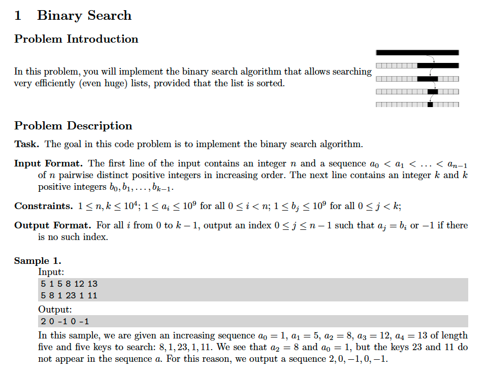

# 1. Binary Search
[https://en.wikipedia.org/wiki/Binary_search_algorithm](https://en.wikipedia.org/wiki/Binary_search_algorithm)

## Problem


## Solutions
* [C](#c)
* [C++](#cpp)
* [Java](#java)
* [Python3](#python3)

### C
```c
    #include <stdio.h>

    typedef int Type;
    const Type NOT_FOUND = -1;

    Type go( Type* A, Type T, size_t lo, size_t hi ){ // search A for (T)arget
        if( lo == hi )
            return NOT_FOUND;
        size_t P = ( lo + hi ) / 2;
        if( T < A[ P ] )
            return go( A, T, lo, P );
        if( T > A[ P ] )
            return go( A, T, P+1, hi );
        return P;
    }
    Type binarySearch( Type* A, Type T, size_t N ){
        return go( A, T, 0, N );
    }

    int main() {
        size_t N = 0;
        scanf( "%zu", &N );
        Type A[ N ];
        for( size_t i=0; i < N; scanf( "%d", &A[ i++ ] ));
        size_t M = 0;
        scanf( "%zu", &M );
        for( Type T = 0; M--; ){
            scanf( "%d", &T );
            Type ans = binarySearch( A, T, N );
            printf( "%d ", ans );
        }
        return 0;
    }
```

### CPP
```cpp
    #include <iostream>
    #include <sstream>
    #include <vector>
    #include <iterator>
    #include <algorithm>

    using namespace std;

    template< typename Type >
    class Solution {
    public:
        using Collection = vector< Type >;
        using Iter = typename Collection::iterator;
        const static Type NOT_FOUND = -1;
        Type binarySearch( Collection& A, Type T ){
            return go( A, T, 0, A.size() );
        }
    private:
        Type go( Collection& A, Type T, size_t lo, size_t hi ){ // search A for (T)arget
            if( lo == hi )
                return NOT_FOUND;
            auto P = ( lo + hi ) / 2;
            if( T < A[ P ] )
                return go( A, T, lo, P );
            if( T > A[ P ] )
                return go( A, T, P+1, hi );
            return P;
        }
    };

    int main() {
        using Type = int;
        Solution< Type > solution;
        Solution< Type >::Collection A, ans;
        size_t N{ 0 }, M{ 0 };
        cin >> N;
        copy_n( istream_iterator< Type >( cin ), N, back_inserter( A ));
        cin >> M;
        for( Type T{ 0 }; M-- && cin >> T; ){
            auto result = solution.binarySearch( A, T );
            ans.push_back( result );
        }
        copy( ans.begin(), ans.end(), ostream_iterator< Type >( cout, " " ));
        return 0;
    }
```

### Java
```java
    import java.util.Scanner;
    import java.util.ArrayList;

    public class Main {
        public static final int NOT_FOUND = -1;
        public static int binarySearch( int[] A, int T ){
            return go( A, T, 0, A.length );
        }
        private static int go( int[] A, int T, int lo, int hi ){
            if( lo == hi )
                return NOT_FOUND;
            int P = ( lo + hi ) / 2;
            if( T < A[ P ] )
                return go( A, T, lo, P );
            if( T > A[ P ] )
                return go( A, T, P+1, hi );
            return P;
        }
        public static void main( String[] args ){
            Scanner input = new Scanner( System.in );
            int N = input.nextInt();
            int[] A = new int[ N ];
            for( int i=0; i < N; A[ i++ ]=input.nextInt() );
            int M = input.nextInt();
            ArrayList< Integer > ans = new ArrayList<>();
            for( int i=0; i < M; ++i ){
                int T = input.nextInt();
                int result = binarySearch( A, T );
                ans.add( result );
            }
            ans.forEach(( i ) -> System.out.print( i + " " ));
        }
    }
```

### Python3
```python
    from typing import List

    NOT_FOUND = -1

    class Solution:
        def binarySearch( self, A: List[int], T: int ) -> List[int]:
            return self.go( A, T, 0, len( A ))
        def go( self, A: List[int], T: int, lo: int, hi: int ) -> List[int]:
            if lo == hi:
                return NOT_FOUND
            P = int(( lo + hi ) / 2 )
            if T < A[ P ]:
                return self.go( A, T, lo, P )
            if T > A[ P ]:
                return self.go( A, T, P+1, hi )
            return P

    if __name__ == '__main__':
        solution = Solution()
        A = list( map( int, input().split() ))
        N = A[ 0 ]
        A.pop( 0 )
        T = list( map( int, input().split() ))
        M = T[ 0 ]
        T.pop( 0 )
        for i in range( 0, M ):
            ans = solution.binarySearch( A, T[ i ] )
            print( ans, end=" " )
```
