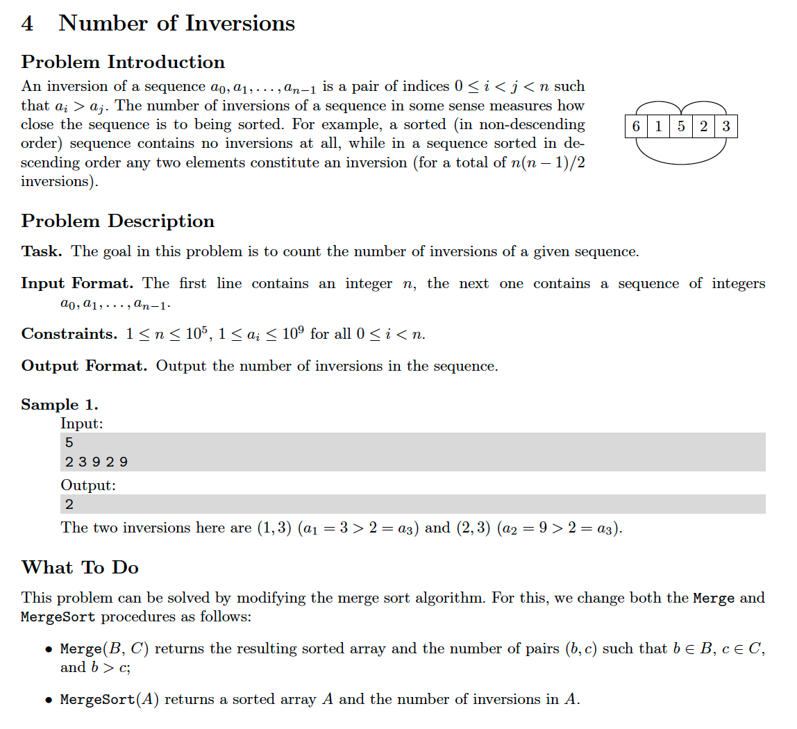

# 4. Array Inversions
[https://en.wikipedia.org/wiki/Inversion_(discrete_mathematics)](https://en.wikipedia.org/wiki/Inversion_(discrete_mathematics))

## Problem


## Solutions
* [C++](#cpp)
* [Python3](#python3)

### CPP
```cpp
    #include <iostream>
    #include <vector>
    #include <sstream>
    #include <algorithm>
    #include <iterator>

    using namespace std;

    template< typename Type >
    class Solution
    {
    public:
        using Collection = vector< Type >;
        size_t inversions( const Collection& A ){
            return go({ A.begin(), A.end() }).count;
        }
    private:
        struct Result{
            Collection A;
            size_t count{ 0 };
        };
        Result go( Collection&& A ){
            if( A.size() < 2 )
                return { A, 0 };
            auto pivot = A.begin() + A.size() / 2;
            return merge( go({ A.begin(), pivot }), go({ pivot, A.end() }) );
        }
        Result merge( Result&& lhs, Result&& rhs ){
            Result res{ {}, lhs.count + rhs.count }; // left + right inversions
            auto L = lhs.A.begin(), R = rhs.A.begin();
            while( L != lhs.A.end() && R != rhs.A.end() )
                if( *L <= *R )
                    res.A.push_back( *L++ );
                else
                    res.A.push_back( *R++ ),
                    res.count += distance( L, lhs.A.end() ); // split inversions
            res.A.insert( res.A.end(), L, lhs.A.end() ), res.A.insert( res.A.end(), R, rhs.A.end() ); // append leftovers ( if applicable )
            return res;
        }
    };

    int main() {
        using Type = size_t;
        Solution< Type > solution;
        Solution< Type >::Collection A;
        auto N{ 0 }; cin >> N;
        copy_n( istream_iterator< Type >( cin ), N, back_inserter( A ));
        auto ans = solution.inversions( A );
        cout << ans << endl;
        return 0;
    }
```

### Python3
```python
    from typing import List

    Result = List[int], int

    class Solution:
        def inversions( self, A: List[int] ) -> Result:
            A, cnt = self.go( A, 0, len(A) )
            return cnt
        def go( self, A: List[int], L: int, R: int ) -> Result:
            size = ( R - L )
            if size < 2:
                return A[L:R], 0
            mid = L + ( size // 2 )
            A1, cnt1 = self.go( A, L, mid )
            A2, cnt2 = self.go( A, mid, R )
            A3, cnt3 = self.merge( A1, A2 )
            return A3, cnt1 + cnt2 + cnt3
        def merge( self, A: List[int], B: List[int] ) -> Result:
            C = []
            i = 0
            j = 0
            cnt = 0
            while i < len(A) and j < len(B):
                if A[i] <= B[j]:
                    C.append( A[i] )
                    i += 1
                else:
                    C.append( B[j] )
                    j += 1
                    cnt += len( A[i:] )
            C.extend( A[i:] )
            C.extend( B[j:] )
            return C, cnt

    if __name__ == '__main__':
        solution = Solution()
        N = input()
        A = list( map( int, input().split() ))
        ans = solution.inversions( A )
        print( ans )
```
