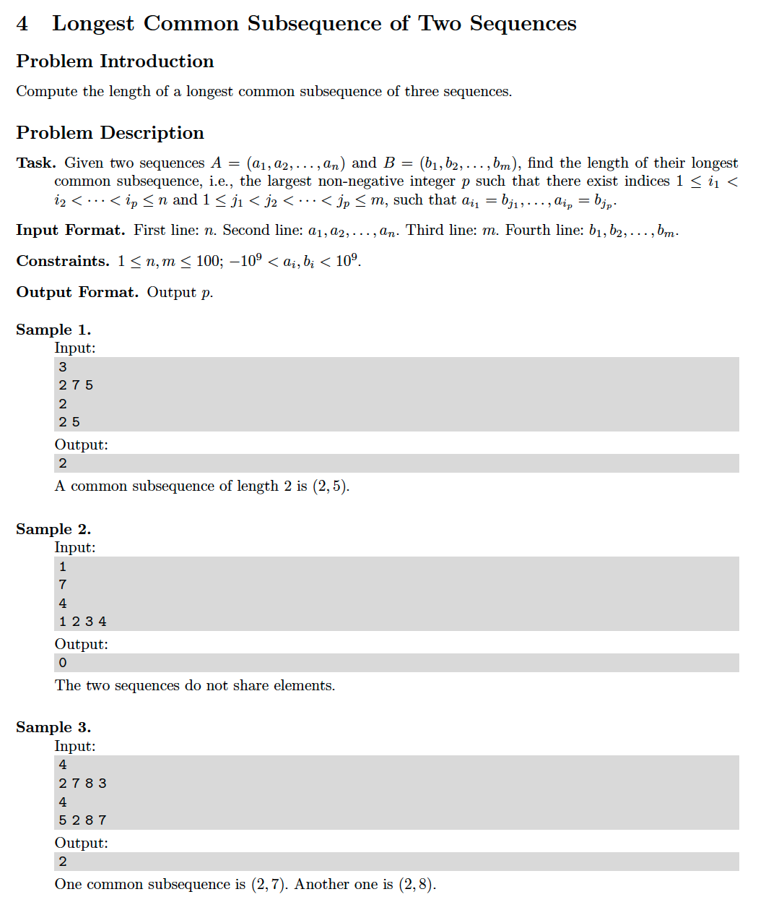

# 4. Longest Common Subsequence
* [https://en.wikipedia.org/wiki/Longest_common_subsequence_problem](https://en.wikipedia.org/wiki/Longest_common_subsequence_problem)

## Problem


## Solutions
* [C++](#cpp)
* [Python3](#python3)

### CPP
```cpp
    #include <iostream>
    #include <sstream>
    #include <iterator>
    #include <algorithm>
    #include <string>
    #include <vector>
    #include <unordered_map>
    #include <cassert>

    using namespace std;

    using Collection = vector< int >;

    namespace TopDown {
        class Solution {
        public:
            using PII = pair< int,int >;
            struct Hash {
                size_t operator()( const PII& p ) const {
                    return 101 * p.first + p.second;
                }
            };
            using Memo = unordered_map< PII, int, Hash >;
            int lcs( const Collection& A, const Collection& B, Memo memo={} ){
                auto M = static_cast< int >( A.size() ),
                     N = static_cast< int >( B.size() );
                return go( A, B, M-1, N-1, memo );
            }
        private:
            int go( const Collection& A, const Collection& B, int i, int j, Memo& memo ){
                if( memo.find({ i,j }) != memo.end() )
                    return memo[{ i,j }];
                if( i < 0 || j < 0 )
                    return memo[{ i,j }] = 0;
                if( A[ i ] == B[ j ] )
                    return memo[{ i,j }] = 1 + go( A, B, i-1, j-1, memo );
                return memo[{ i,j }] =
                    max( go( A, B, i-1, j, memo ),
                         go( A, B, i, j-1, memo ));
            }
        };
    }
    namespace BottomUp {
        class Solution {
        public:
            using VI = vector< int >;
            using VVI = vector< VI >;
            int lcs( const Collection& A, const Collection& B ){
                auto M = static_cast< int >( A.size() ),
                     N = static_cast< int >( B.size() );
                VVI dp( M+1, VI( N+1, 0 ));
                for( auto i{ 1 }; i <= M; ++i )
                    for( auto j{ 1 }; j <= N; ++j )
                        if( A[ i-1 ] == B[ j-1 ] )
                            dp[ i ][ j ] = 1 + dp[ i-1 ][ j-1 ];
                        else
                            dp[ i ][ j ] = max( dp[ i-1 ][ j ], dp[ i ][ j-1 ] );
                return dp[ M ][ N ];
            }
        };
    }

    int main() {
        Collection A, B;
        auto M{ 0 }; cin >> M; copy_n( istream_iterator< int >( cin ), M, back_inserter( A ));
        auto N{ 0 }; cin >> N; copy_n( istream_iterator< int >( cin ), N, back_inserter( B ));
        auto ans1 = TopDown::Solution().lcs( A, B );
        auto ans2 = BottomUp::Solution().lcs( A, B );
        assert( ans1 == ans2 );
        cout << ans1 << endl;
        return 0;
    }
```

### Python3
```python
    from typing import List, Dict

    class RECSolution:
        Memo = Dict[ int,int ]
        def hash( self, i: int, j: int ) -> int:
            return 101 * i + j
        def lcs( self, A: List[int], B: List[int], M: int, N: int, memo: Memo={} ) -> int:
            return self.go( A, B, M-1, N-1, memo )
        def go( self, A: List[int], B: List[int], i: int, j: int, memo: Memo ) -> int:
            key = self.hash( i,j )
            if i < 0 or j < 0:
                memo[ key ] = 0
            if key in memo:
                return memo[ key ]
            if A[ i ] == B[ j ]:
                memo[ key ] = 1 + self.go( A, B, i-1, j-1, memo )
            else:
                memo[ key ] = max( self.go( A, B, i-1, j, memo ), self.go( A, B, i, j-1, memo ))
            return memo[ key ]

    class DPSolution:
        def lcs( self, A: List[int], B: List[int], M: int, N: int ) -> int:
            dp = [[ 0 ] * ( N+1 ) for _ in range( M+1 ) ]
            for i in range( 1, M+1 ):
                for j in range( 1, N+1 ):
                    if A[ i-1 ] == A[ j-1 ]:
                        dp[ i ][ j ] = 1 + dp[ i-1 ][ j-1 ]
                    else:
                        dp[ i ][ j ] = max( dp[ i-1 ][ j ], dp[ i ][ j-1 ] )
            return dp[ M ][ N ]

    if __name__ == '__main__':
        rec_solution = RECSolution()
        dp_solution = DPSolution()
        M, A = int( input() ), list( map( int, input().split() ))
        N, B = int( input() ), list( map( int, input().split() ))
        ans1 = rec_solution.lcs( A, B, M, N )
        ans2 = dp_solution.lcs( A, B, M, N )
        assert( ans1 == ans2 )
        print( ans1 )
```
