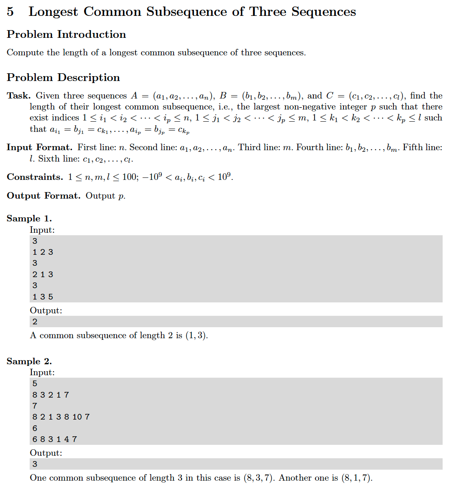

# 5. Longest Common Subsequence of Three Sequences
* [https://en.wikipedia.org/wiki/Longest_common_subsequence_problem](https://en.wikipedia.org/wiki/Longest_common_subsequence_problem)

## Problem


## Solutions
* [C++](#cpp)
* [Python3](#python3)

### CPP
```cpp
    #include <iostream>
    #include <sstream>
    #include <iterator>
    #include <algorithm>
    #include <string>
    #include <vector>
    #include <unordered_map>
    #include <cassert>

    using namespace std;

    using Collection = vector< int >;

    namespace TopDown {
        class Solution {
        public:
            using T3 = tuple< int,int,int >;
            struct Hash {
                size_t operator()( const T3& tuple ) const {
                    int i{ 0 }, j{ 0 }, k{ 0 };
                    tie( i, j, k ) = tuple;
                    return 101 * 101 * i + 101 * j + k;
                }
            };
            using Memo = unordered_map< T3, int, Hash >;
            int lcs( const Collection& A, const Collection& B, const Collection& C, Memo memo={} ){
                auto M = static_cast< int >( A.size() ),
                     N = static_cast< int >( B.size() ),
                     O = static_cast< int >( C.size() );
                return go( A, B, C, M-1, N-1, O-1, memo );
            }
        private:
            int go( const Collection& A, const Collection& B, const Collection& C, int i, int j, int k, Memo& memo ){
                auto key = make_tuple( i,j,k );
                if( memo.find( key ) != memo.end() )
                    return memo[ key ];
                if( i < 0 || j < 0 || k < 0 )
                    return memo[ key ] = 0;
                if( A[ i ] == B[ j ] && A[ i ] == C[ k ])
                    return memo[ key ] = 1 + go( A, B, C, i-1, j-1, k-1, memo );
                return memo[ key ] = max({ go( A, B, C, i-1, j, k, memo ),
                                           go( A, B, C, i, j-1, k, memo ),
                                           go( A, B, C, i, j, k-1, memo ), });
            }
        };
    }
    namespace BottomUp {
        class Solution {
        public:
            using VI = vector< int >;
            using VVI = vector< VI >;
            using VVVI = vector< VVI >;
            int lcs( const Collection& A, const Collection& B, const Collection& C ){
                auto M = static_cast< int >( A.size() ),
                     N = static_cast< int >( B.size() ),
                     O = static_cast< int >( C.size() );
                VVVI dp( M+1, VVI( N+1, VI( O+1, 0 )));
                for( auto i{ 1 }; i <= M; ++i )
                    for( auto j{ 1 }; j <= N; ++j )
                        for( auto k{ 1 }; k <= O; ++k )
                            if( A[ i-1 ] == B[ j-1 ] && A[ i-1 ] == C[ k-1 ] )
                                dp[ i ][ j ][ k ] = 1 + dp[ i-1 ][ j-1 ][ k-1 ];
                            else
                                dp[ i ][ j ][ k ] = max({ dp[ i-1 ][ j ][ k ],
                                                          dp[ i ][ j-1 ][ k ],
                                                          dp[ i ][ j ][ k-1 ], });
                return dp[ M ][ N ][ O ];
            }
        };
    }

    int main() {
        Collection A, B, C;
        auto M{ 0 }; cin >> M; copy_n( istream_iterator< int >( cin ), M, back_inserter( A ));
        auto N{ 0 }; cin >> N; copy_n( istream_iterator< int >( cin ), N, back_inserter( B ));
        auto O{ 0 }; cin >> O; copy_n( istream_iterator< int >( cin ), O, back_inserter( C ));
        auto ans1 = TopDown::Solution().lcs( A, B, C );
        auto ans2 = BottomUp::Solution().lcs( A, B, C );
        assert( ans1 == ans2 );
        cout << ans1 << endl;
        return 0;
    }
```

### Python3
```python
    from typing import List, Dict

    class RECSolution:
        Memo = Dict[ int,int ]
        def hash( self, i: int, j: int, k: int ) -> int:
            return 101 * 101 * i + 101 * j + k
        def lcs( self, A: List[int], B: List[int], C: List[int], M: int, N: int, O: int, memo: Memo={} ) -> int:
            return self.go( A, B, C, M-1, N-1, O-1, memo )
        def go( self, A: List[int], B: List[int], C: List[int], i: int, j: int, k: int, memo: Memo ) -> int:
            key = self.hash( i,j,k )
            if i < 0 or j < 0 or k < 0:
                memo[ key ] = 0
            if key in memo:
                return memo[ key ]
            if A[ i ] == B[ j ] and A[ i ] == C[ k ]:
                memo[ key ] = 1 + self.go( A, B, C, i-1, j-1, k-1, memo )
            else:
                memo[ key ] = max(
                    self.go( A, B, C, i-1, j, k, memo ),
                    self.go( A, B, C, i, j-1, k, memo ),
                    self.go( A, B, C, i, j, k-1, memo ), )
            return memo[ key ]

    class DPSolution:
        def lcs( self, A: List[int], B: List[int], C: List[int], M: int, N: int, O: int ) -> int:
            dp = [[[ 0 for _ in range( O+1 )] for _ in range( N+1 )] for _ in range( M+1 ) ]
            for i in range( 1, M+1 ):
                for j in range( 1, N+1 ):
                    for k in range( 1, O+1 ):
                        if A[ i-1 ] == B[ j-1 ] and A[ i-1 ] == C[ k-1 ]:
                            dp[ i ][ j ][ k ] = 1 + dp[ i-1 ][ j-1 ][ k-1 ]
                        else:
                            dp[ i ][ j ][ k ] = max(
                                dp[ i-1 ][ j ][ k ],
                                dp[ i ][ j-1 ][ k ],
                                dp[ i ][ j ][ k-1 ], )
            return dp[ M ][ N ][ O ]

    if __name__ == '__main__':
        rec_solution = RECSolution()
        dp_solution = DPSolution()
        M, A = int( input() ), list( map( int, input().split() ))
        N, B = int( input() ), list( map( int, input().split() ))
        O, C = int( input() ), list( map( int, input().split() ))
        ans1 = rec_solution.lcs( A, B, C, M, N, O )
        ans2 = dp_solution.lcs( A, B, C, M, N, O )
        assert( ans1 == ans2 )
        print( ans1 )
```
