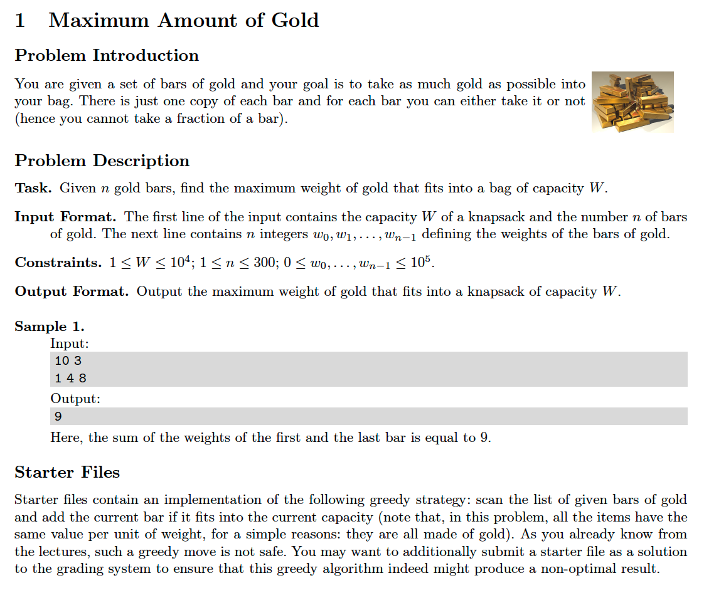

# 1. Maximum Amount of Gold
* [https://en.wikipedia.org/wiki/Knapsack_problem](https://en.wikipedia.org/wiki/Knapsack_problem)

## Problem


## Solutions
* [C++](#cpp)
* [Python3](#python3)

### CPP
```cpp
    #include <iostream>
    #include <sstream>
    #include <algorithm>
    #include <iterator>
    #include <vector>
    #include <unordered_map>
    #include <numeric>
    #include <cassert>

    using namespace std;

    using Collection = vector< int >;

    namespace TopDown {
        class Solution {
        public:
            using PII = pair< int,int >;
            struct Hash {
                size_t operator()( const PII& p ) const {
                    return 1e4+1 * p.first + p.second;
                }
            };
            using Memo = unordered_map< PII,int, Hash >;
            int maxKnapsack( const Collection& A, int T, Memo memo={} ){
                auto N = static_cast< int >( A.size() );
                return go( A, T, N-1, memo );
            }
        private:
            int go( const Collection& A, int T, int i, Memo& memo, int with=0 ){
                auto key = make_pair( T,i );
                if( memo.find( key ) != memo.end() )
                    return memo[ key ];
                if( i < 0 )
                    return memo[ key ] = 0;
                if( 0 <= T - A[ i ] )
                    with = A[ i ] + go( A, T - A[ i ], i-1, memo );
                auto without = go( A, T, i-1, memo );
                return memo[ key ] = max( with, without );
            }
        };
    }
    namespace BottomUp {
        class Solution {
        public:
            using VI = vector< int >;
            using VVI = vector< VI >;
            int maxKnapsack( const Collection& A, int T ){
                auto N = static_cast< int >( A.size() );
                VVI dp( N+1, VI( T+1, 0 ));
                for( auto i{ 1 }; i <= N; ++i )
                    for( auto j{ 1 }; j <= T; ++j )
                        if( 0 <= j - A[ i-1 ] )
                            dp[ i ][ j ] = max( A[ i-1 ] + dp[ i-1 ][ j - A[ i-1 ]], dp[ i-1 ][ j ]); // max( with, without )
                        else
                            dp[ i ][ j ] = dp[ i-1 ][ j ]; // without
                return dp[ N ][ T ];
            }
        };
    }

    int main() {
        auto T{ 0 }; cin >> T; // (T)otal capacity
        auto N{ 0 }; cin >> N; // N unique items ( take it or leave it )
        Collection A;
        copy_n( istream_iterator< int >( cin ), N, back_inserter( A ));
        auto ans1 = TopDown::Solution().maxKnapsack( A, T );
        auto ans2 = BottomUp::Solution().maxKnapsack( A, T );
        assert( ans1 == ans2 );
        cout << ans2 << endl;
        return 0;
    }
```

### Python3
```python
    from typing import List, Dict

    Memo = Dict[ int,int ]

    class RECSolution:
        def hash( self, T: int, i: int ) -> int:
            return T + 10001 * i
        def maxKnapsack( self, A: List[int], T: int, memo: Memo={} ) -> int:
            N = len( A )
            return self.go( A, T, N-1, memo )
        def go( self, A: List[int], T: int, i: int, memo: Memo ) -> int:
            key = self.hash( T,i )
            if key in memo:
                return memo[ key ]
            if i < 0:
                memo[ i ] = 0
                return memo[ i ]
            w = A[ i ] + self.go( A, T - A[ i ], i-1, memo ) if 0 <= T - A[ i ] else 0
            wo = self.go( A, T, i-1, memo )
            memo[ key ] = max( w, wo ) # max( with, without )
            return memo[ key ]

    class DPSolution:
        def maxKnapsack( self, A: List[int], T: int ):
            N = len( A )
            dp = [[ 0 for _ in range( T+1 )] for _ in range( N+1 )]
            for i in range( 1, N+1 ):
                for j in range( 1, T+1 ):
                    if 0 <= j - A[ i-1 ]:
                        dp[ i ][ j ] = max( A[ i-1 ] + dp[ i-1 ][ j - A[ i-1 ]], dp[ i-1 ][ j ] ) # max( with, without )
                    else:
                        dp[ i ][ j ] = dp[ i-1 ][ j ] # without
            return dp[ N ][ T ]

    if __name__ == '__main__':
        T, N = map( int, input().split() )
        A = list( map( int, input().split() ))
        ans1 = RECSolution().maxKnapsack( A, T )
        ans2 = DPSolution().maxKnapsack( A, T )
        assert( ans1 == ans2 )
        print( ans1 )
```
