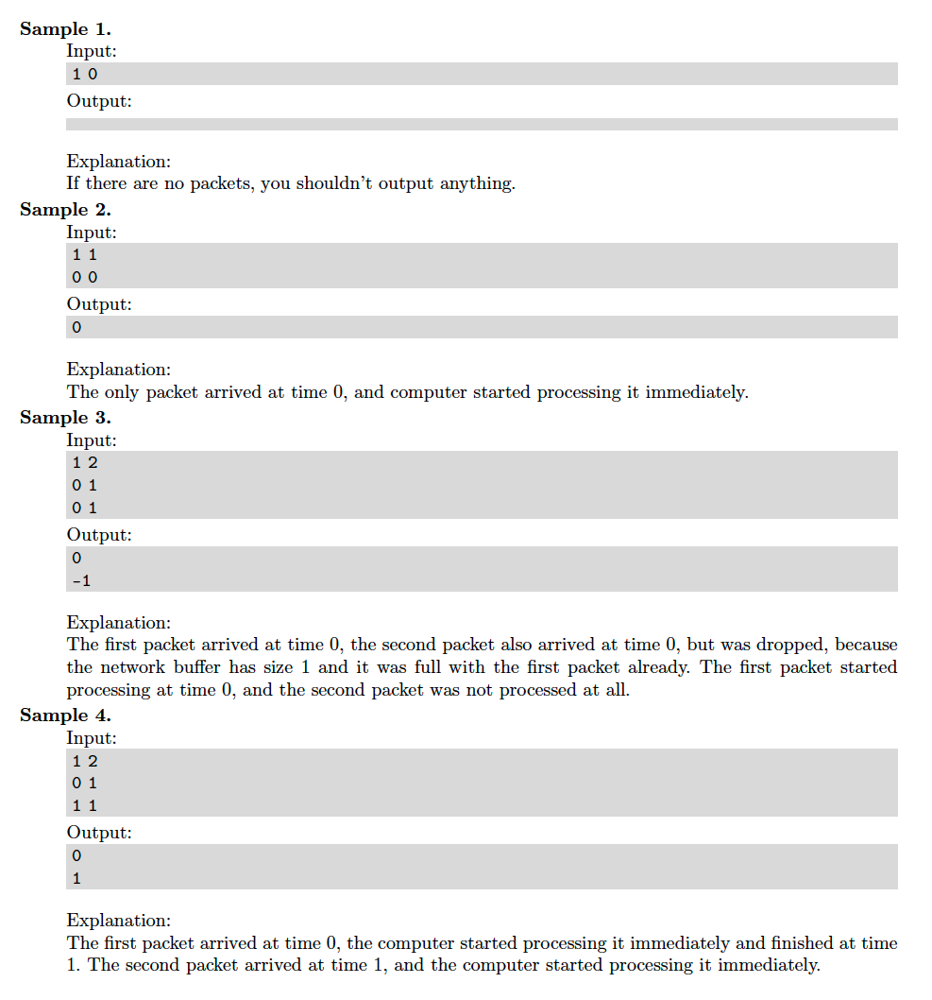
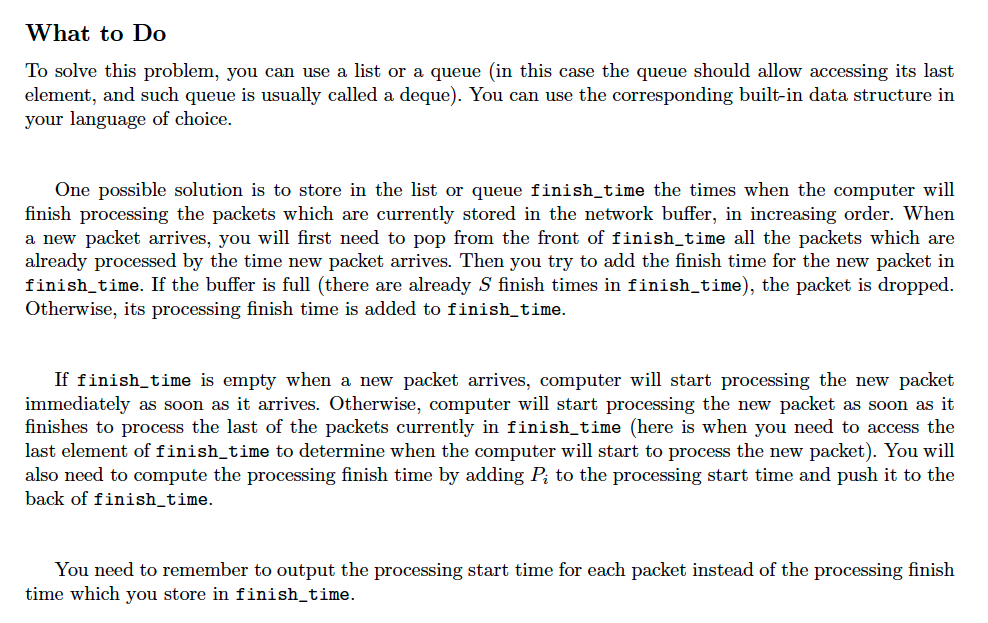

# 3. Packet Processing
* [https://en.wikipedia.org/wiki/Packet_processing](https://en.wikipedia.org/wiki/Packet_processing)

## Problem




## Solutions
* [C++](#cpp)

### CPP
```cpp
    #include <iostream>
    #include <sstream>
    #include <algorithm>
    #include <iterator>
    #include <vector>
    #include <set>
    #include <map>
    
    using namespace std;
    
    class Solution {
    public:
        using Packets = multimap< int,int >; // beg, end
        using Queue = multiset< int >;       //      end
        using Answer = vector< int >;
        Answer process( const Packets& P, int S, int N, Queue q={}, Answer ans={} ){
            for( auto time{ 0 }, last{ 0 }; time <= 1e5; ++time ){
                q.erase( time ); // erase all packets finished processing from (q)ueue at this time
                auto range = P.equal_range( time );
                for( auto it = range.first; it != range.second; ++it ){
                    if( q.size() == S ){
                        ans.push_back( -1 );
                        continue;
                    }
                    auto beg = it->first,
                         end = it->second;
                    if( beg < last ){
                        auto delta = last - beg; // overlapping processes, shift-right (beg)in and end by overlap delta
                        beg += delta;
                        end += delta;
                    }
                    ans.push_back( beg );
                    if( time < end ){    // insert into (q)ueue if not immediately processed ( if (p)rocessing time == 0, then time == end )
                        q.insert( end );
                        last = end;      // store last end to see if it overlaps with the next (beg)in
                    }
                }
            }
            return ans;
        }
    };
    
    int main() {
        auto S{ -1 }, N{ -1 };
        Solution::Packets P;
        string line;
        getline( cin, line ); {
            istringstream parser{ line };
            parser >> S >> N;
        }
        for( auto i{ 0 }; i < N && getline( cin, line ); ++i ){
            istringstream parser{ line };
            auto a{ 0 }, p{ 0 };
            parser >> a >> p;
            P.insert({ a, a+p }); // (a)rrival time, (a)rrival time + (p)rocessing time
        }
        auto ans = Solution().process( P, S, N );
        copy( ans.begin(), ans.end(), ostream_iterator< int >( cout, "\n" ) );
        return 0;
    }
```
