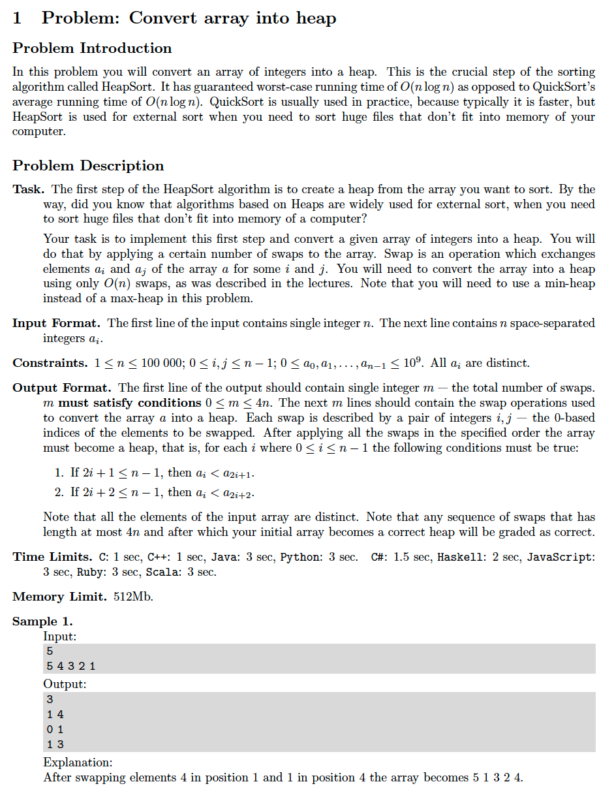
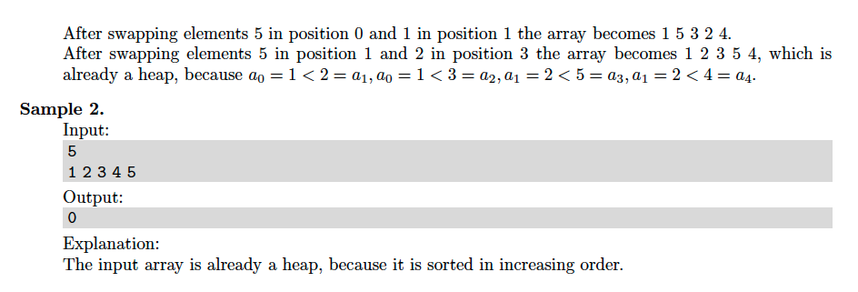

# 1. Convert Array to Heap
[https://en.wikipedia.org/wiki/Heap_(data_structure)](https://en.wikipedia.org/wiki/Heap_(data_structure))

## Problem



## Solutions
* [C++](#cpp)

### CPP
```cpp
    #include <iostream>
    #include <sstream>
    #include <iterator>
    #include <algorithm>
    #include <vector>
    #include <limits>
    
    using namespace std;
    
    class Solution {
    public:
        using Collection = vector< int >;
        struct Swap{ int first{ 0 }, second{ 0 }; };
        using Swaps = vector< Swap >;
        using Result = pair< int, Swaps >;
        Result heapify( Collection& A, int cnt=0, Swaps S={} ){
            auto N = static_cast< int >( A.size() );
            for( auto i{ N/2 }; 0 <= i; --i )
                cnt += siftDown( A, S, i );
            return{ cnt, S };
        }
        friend ostream& operator<<( ostream& out, const Swap& swap ){
            return out << swap.first << " " << swap.second;
        }
    private:
        int violation( const Collection &A, int i ){ // if violation, return minimum valued child's index, otherwise 0
            auto N = static_cast< int >( A.size() );
            if( i < 0 || N <= i )
                return 0;
            auto j{ i },
                 L{ 2 * i + 1 }, // (L)eft child
                 R{ 2 * i + 2 }; // (R)ight child
            if( L < N && A[ L ] < A[ j ] )
                j = L;
            if( R < N && A[ R ] < A[ j ] )
                j = R;
            return( i == j )? 0 : j;
        }
        int siftDown( Collection& A, Swaps& S, int i ){
            auto N = static_cast< int >( A.size() );
            if( N/2 < i )
                return 0;
            auto j = violation( A, i );
            if( j == 0 )
                return 0;
            swap( A[ j ], A[ i ] );
            S.push_back({ i,j });
            return 1 + siftDown( A, S, j );
        }
    };
    
    int main() {
        auto N{ 0 }; cin >> N;
        Solution::Collection A;
        copy_n( istream_iterator< int >( cin ), N, back_inserter( A ) );
        auto[ cnt, swaps ] = Solution().heapify( A );
        cout << cnt << endl;
        copy( swaps.begin(), swaps.end(), ostream_iterator< Solution::Swap >( cout, "\n" ) );
        return 0;
    }
```
