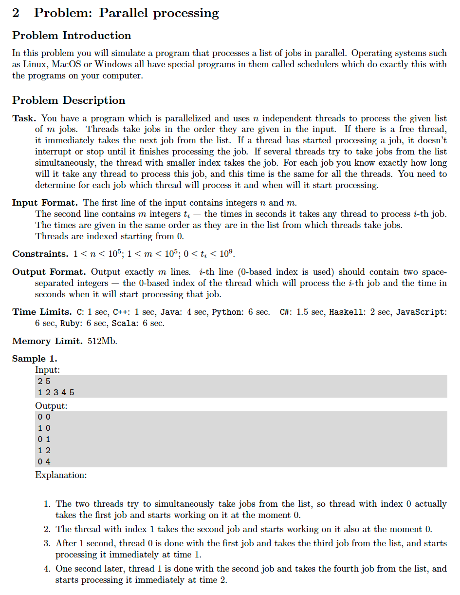
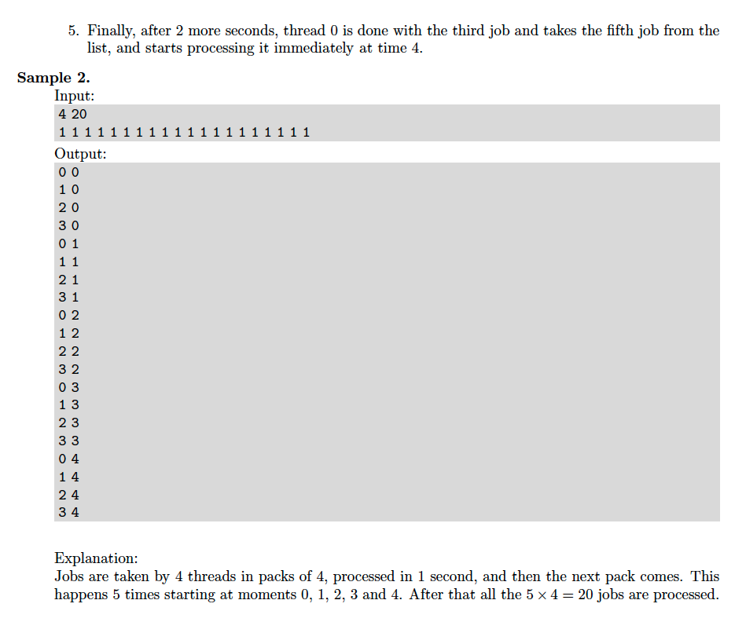

# 2. Parallel Processing
[https://en.wikipedia.org/wiki/Priority_queue](https://en.wikipedia.org/wiki/Priority_queue)

## Problem



## Solutions
* [C++](#cpp)

### CPP
```cpp
    #include <iostream>
    #include <sstream>
    #include <queue>
    #include <vector>
    #include <algorithm>
    #include <iterator>
    
    using namespace std;
    
    template< typename Type >
    class Solution {
    public:
        using Collection = vector< Type >;
        struct Thread{ Type id{ 0 }, finish{ 0 }; };
        using Threads = vector< Thread >;
        struct Cmp {
            bool operator()( const Thread& lhs, const Thread& rhs ) const {
                return( lhs.finish > rhs.finish )? true
                    : ( lhs.finish < rhs.finish )? false
                    : ( lhs.id > rhs.id );
            }
        };
        using Queue = priority_queue< Thread, Threads, Cmp >;
        Threads process( const Collection& jobs, size_t N, Queue q=Queue(), Threads ans={} ){
            for( Type i{ 0 }; i < N; q.push({ i++,0 }) );
            for( auto job: jobs ){
                auto t = q.top(); q.pop();
                ans.push_back({ t.id, t.finish });
                t.finish += job;
                q.push( t );
            }
            return ans;
        }
        friend ostream& operator<<( ostream& os, const Thread& t ){
            os << t.id << " " << t.finish;
            return os;
        }
    };
    
    int main() {
        size_t N{ 0 }, M{ 0 }; {
            string line;
            getline( cin, line );
            istringstream parser{ line };
            parser >> N >> M;
        }
        using Type = unsigned long long;
        Solution< Type >::Collection A;
        copy_n( istream_iterator< int >( cin ), M, back_inserter( A ) );
        auto ans = Solution< Type >().process( A, N );
        copy( ans.begin(), ans.end(), ostream_iterator< Solution< Type >::Thread >( cout, "\n" ) );
        return 0;
    }
```
