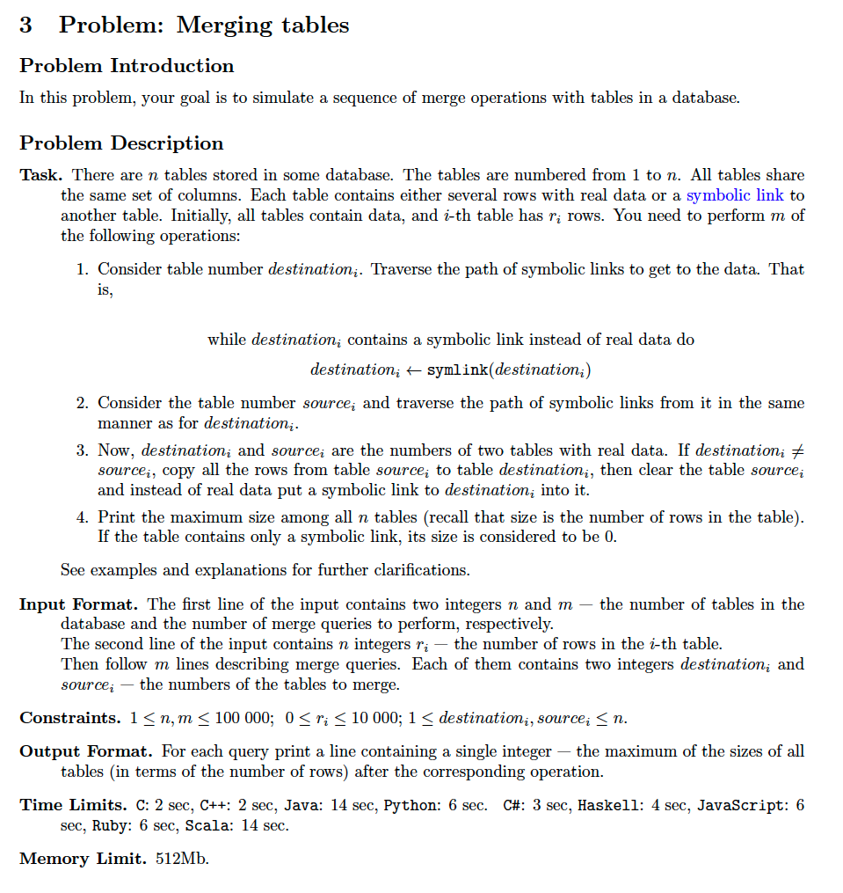
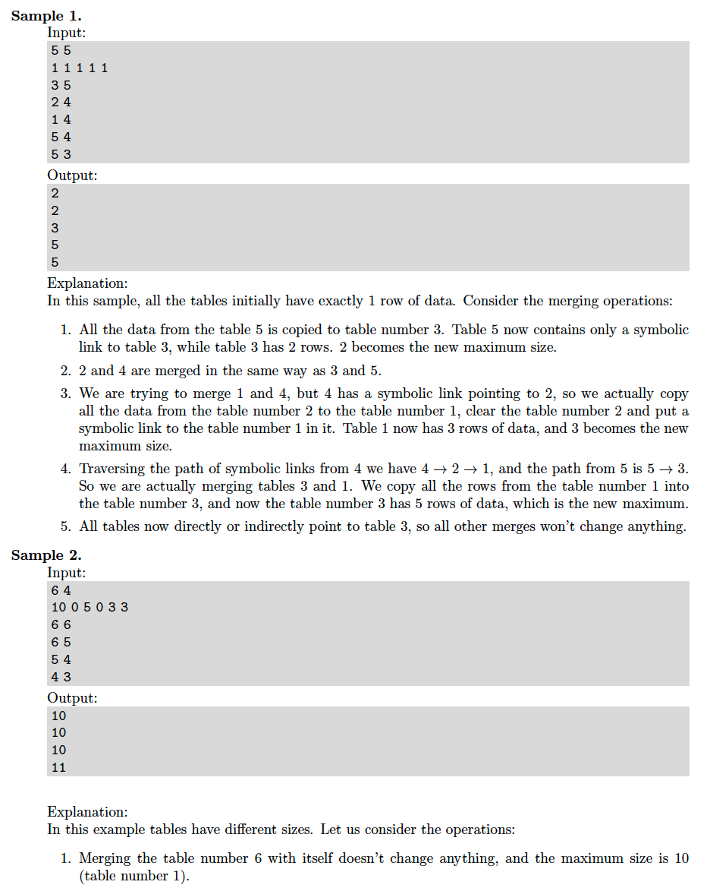

# 3. Merging Tables
[https://en.wikipedia.org/wiki/Disjoint-set_data_structure](https://en.wikipedia.org/wiki/Disjoint-set_data_structure)

## Problem




## Solutions
* [C++](#cpp)

### CPP
```cpp
    #include <iostream>
    #include <sstream>
    #include <algorithm>
    #include <iterator>
    #include <vector>
    #include <string>
    
    using namespace std;
    
    class DisjointSet {
    public:
        using Collection = vector< int >;
        DisjointSet( istream& is, int N ) : P( N+1 ), V{ 0 }, M{ 0 } {           // N+1 (P)arent set representatives for 1-based indexing, { 0 } is a dummy for corresponding 1-based indexed (V)alues ( i.e. V.size() == 1 )
            generate( P.begin(), P.end(), [ i = -1 ]() mutable { return ++i; }); // init each (P)arent as a set representative of itself ( i.e. P[ 0 ] = 0, P[ 1 ] = 1, ... , P[ N-1 ] = N-1, P[ N ] = N )
            copy_n( istream_iterator< int >( is ), N, back_inserter( V ) );      // read each set representative's (V)alue and append onto { 0 } for 1-based indexing
            M = *max_element( V.begin(), V.end() );                              // (M)aximum (V)alue
        }
        int Union( int a, int b ){
            a = Find( a );
            b = Find( b );
            if( a == b )
                return M;
            P[ b ] = P[ a ];
            V[ a ] += V[ b ], V[ b ] = 0;
            if( M < V[ a ] )
                M = V[ a ];
            return M;
        }
        int Find( int x ){
            if( P[ x ] == x )
                return P[ x ];
            return P[ x ] = Find( P[ x ] );
        }
    private:
        Collection P, V; // (P)arent / (V)alue
        int M;           // (M)aximum value
    };
    
    int main() {
        string line;
        auto N{ 0 }, M{ 0 }; {
            getline( cin, line );
            istringstream is{ line };
            is >> N >> M;
        }
        DisjointSet ds{ cin, N };
        for( auto a{ 0 }, b{ 0 } ; M--; ){
            cin >> a >> b;
            cout << ds.Union( a, b ) << endl;
        }
        return 0;
    }
```
