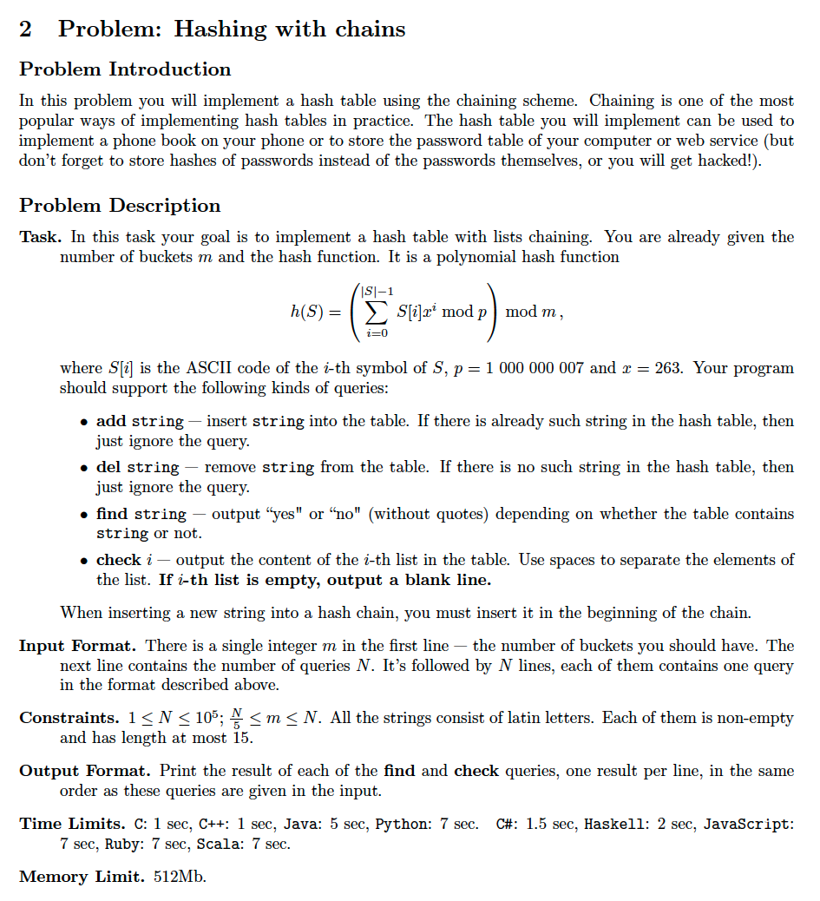
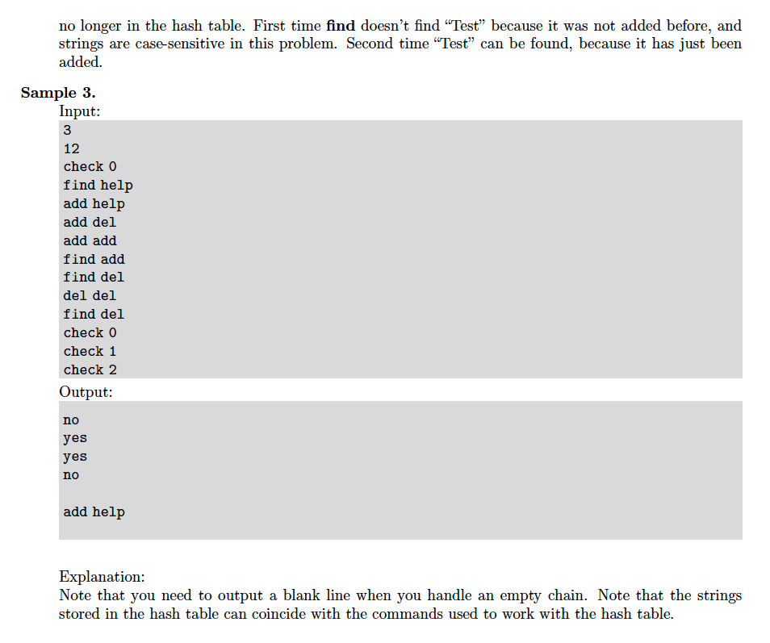

# 2. Hashing with Chains
[https://en.wikipedia.org/wiki/Hash_table](https://en.wikipedia.org/wiki/Hash_table)

## Problem




## Solutions
* [C++](#cpp)

### CPP
```cpp
    #include <iostream>
    #include <sstream>
    #include <string>
    #include <vector>
    #include <list>
    #include <unordered_map>
    #include <algorithm>
    #include <iterator>
    
    using namespace std;
    
    class Solution {
    public:
        explicit Solution( int M ) : mod_{ M } {}
        void add( const string& s ){
            if( find( s ) == "yes" )
                return;
            auto key = hash( s );
            map_[ key ].push_front( s );
        }
        void del( const string& s ){
            auto key = hash( s );
            auto& l = map_[ key ];
            auto it = ::find( l.begin(), l.end(), s );
            if( it != l.end() )
                l.erase( it );
        }
        string find( const string& s ){
            auto key = hash( s );
            auto& l = map_[ key ];
            auto it = std::find( l.begin(), l.end(), s );
            return( it != l.end() )? "yes" : "no";
        }
        string check( int key ){
            ostringstream os;
            auto& l = map_[ key ];
            copy( l.begin(), l.end(), ostream_iterator< string >( os, " " ) );
            return os.str();
        }
    private:
        using Map = unordered_map< int, list< string > >;
        Map map_;
        int mod_;
        using ULL = unsigned long long;
        int hash( const string& s, ULL res=0 ){
            static constexpr ULL p{ 1000000007 }, x{ 263 };
            for( ULL i{ 0 }, Xi{ 1 }; i < s.size(); ++i, Xi *= x, Xi %= p ){
                res += s[ i ] * Xi;
                res %= p;
            }
            return static_cast< int >( res % mod_ );
        }
    };
    
    int main() {
        auto M{ 0 }, N{ 0 };
        string line, cmd, word;
        getline( cin, line ); {
            istringstream parser{ line };
            parser >> M;
        }
        Solution solution{ M };
        getline( cin, line ); {
            istringstream parser{ line };
            parser >> N;
        }
        vector< string > ans;
        for( auto key{ 0 }; N--; ){
            getline( cin, line );
            istringstream parser{ line };
            parser >> cmd;
            if( cmd == "add" ){
                parser >> word;
                solution.add( word );
            }
            if( cmd == "del" ){
                parser >> word;
                solution.del( word );
            }
            if( cmd == "find" ){
                parser >> word;
                auto found = solution.find( word );
                ans.emplace_back( found );
            }
            if( cmd == "check" ){
                parser >> key;
                auto result = solution.check( key );
                ans.emplace_back( result );
            }
        }
        copy( ans.begin(), ans.end(), ostream_iterator< string >( cout, "\n" ) );
        return 0;
    }
```
