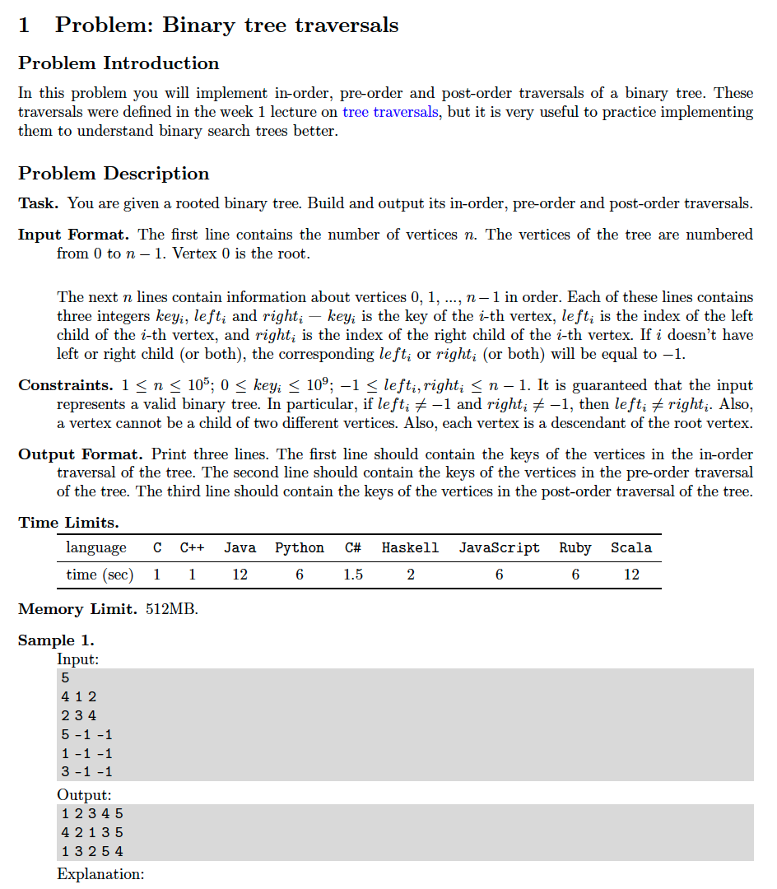
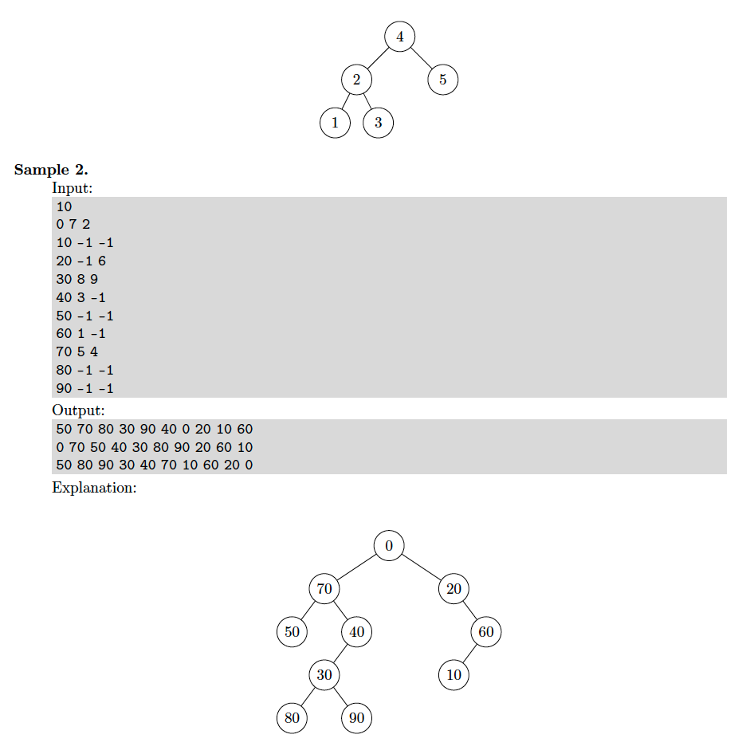

# 1. Binary Tree Traversals
* [https://en.wikipedia.org/wiki/Tree_traversal](https://en.wikipedia.org/wiki/Tree_traversal)

## Problem



## Solutions
* [C++](#cpp)

### CPP
```cpp
    #include <iostream>
    #include <sstream>
    #include <vector>
    #include <memory>
    #include <algorithm>
    #include <iterator>
    #include <tuple>
    #include <cassert>
    
    using namespace std;
    
    enum class Order {
        Pre,
        In,
        Post,
    };
    
    struct TreeNode;
    using HTreeNode = shared_ptr< TreeNode >;
    struct TreeNode {
        int val;
        HTreeNode left, right;
        TreeNode( int val ) : val{ val }, left{ nullptr }, right{ nullptr } {}
        friend ostream& operator<<( ostream& os, const HTreeNode& node ){
            if( node )
                os << node->val;
            return os;
        }
    };
    using Collection = vector< HTreeNode >;
    
    class ISolution {
    public:
        virtual Collection traverse( HTreeNode root, Order order, Collection ans={} ) = 0;
    };
    using HSolution = shared_ptr< ISolution >;
    using T3 = tuple< Collection,Collection,Collection >;
    T3 run( HSolution solution, const Collection& A ){
        auto in   = solution->traverse( A[ 0 ], Order::In ),
             pre  = solution->traverse( A[ 0 ], Order::Pre ),
             post = solution->traverse( A[ 0 ], Order::Post );
        return{ in, pre, post };
    }
    
    namespace Recursive {
        class Solution : public ISolution {
        public:
            virtual Collection traverse( HTreeNode root, Order order, Collection ans={} ) override {
                go( root, order, ans );
                return ans;
            }
        private:
            void go( HTreeNode root, Order order, Collection& ans ){
                if( ! root )
                    return;
                if( order == Order::In ){
                    go( root->left, order, ans );
                    ans.push_back( root );
                    go( root->right, order, ans );
                }
                if( order == Order::Pre ){
                    ans.push_back( root );
                    go( root->left, order, ans );
                    go( root->right, order, ans );
                }
                if( order == Order::Post ){
                    go( root->left, order, ans );
                    go( root->right, order, ans );
                    ans.push_back( root );
                }
            }
        };
    }
    namespace Iterative {
        class Solution : public ISolution {
        public:
            virtual Collection traverse( HTreeNode root, Order order, Collection ans={} ) override {
                switch( order ){
                    case Order::In:   return inorder( root );
                    case Order::Pre:  return preorder( root );
                    case Order::Post: return postorder( root );
                    default:          return {};
                }
            }
        private:
            Collection inorder( HTreeNode node, Collection stack={}, Collection ans={} ){
                while( node || ! stack.empty() ){
                    if( node ){
                        stack.push_back( node );
                        node = node->left;
                    } else {
                        node = stack.back(), stack.pop_back();
                        ans.push_back( node );
                        node = node->right;
                    }
                }
                return ans;
            }
            Collection preorder( HTreeNode node, Collection stack={}, Collection ans={} ){
                if( node )
                    stack.push_back( node );
                while( ! stack.empty() ){
                    node = stack.back(), stack.pop_back();
                    ans.push_back( node );
                    if( node->right ) stack.push_back( node->right ); // push right child to stack first, so left child is processed first
                    if( node->left )  stack.push_back( node->left );
                }
                return ans;
            }
            Collection postorder( HTreeNode node, Collection stack={}, Collection ans={} ){
                HTreeNode last{ nullptr };
                while( node || ! stack.empty() ){
                    if( node ){
                        stack.push_back( node );
                        node = node->left;
                    } else {
                        auto peek = stack.back();
                        if( peek->right && peek->right != last ){
                            node = peek->right;
                        } else {
                            ans.push_back( peek );
                            last = stack.back(), stack.pop_back();
                        }
                    }
                }
                return ans;
            }
        };
    }
    
    int main() {
        string line;
        auto N{ 0 }; {
            getline( cin, line );
            istringstream is{ line };
            is >> N;
        }
        Collection A;
        generate_n( back_inserter( A ), N, [](){ return make_shared< TreeNode >( 0 ); });
        for( auto i{ 0 }; i < N && getline( cin, line ); ++i ){
            istringstream parser{ line };
            auto val{ 0 }, L{ 0 }, R{ 0 };
            parser >> val >> L >> R;
            A[ i ]->val = val;
            A[ i ]->left =  ( -1 < L )? A[ L ] : nullptr;
            A[ i ]->right = ( -1 < R )? A[ R ] : nullptr;
        }
        HSolution rec = make_shared< Recursive::Solution >(),
                  itr = make_shared< Iterative::Solution >();
        auto[ in1, pre1, post1 ] = run( rec, A );
        auto[ in2, pre2, post2 ] = run( itr, A );
        assert( in1   == in2   );
        assert( pre1  == pre2  );
        assert( post1 == post2 );
        copy( in1.begin(), in1.end(), ostream_iterator< HTreeNode >( cout, " " ) ); cout << endl;
        copy( pre1.begin(), pre1.end(), ostream_iterator< HTreeNode >( cout, " " ) ); cout << endl;
        copy( post1.begin(), post1.end(), ostream_iterator< HTreeNode >( cout, " " ) ); cout << endl;
        return 0;
    }
```
