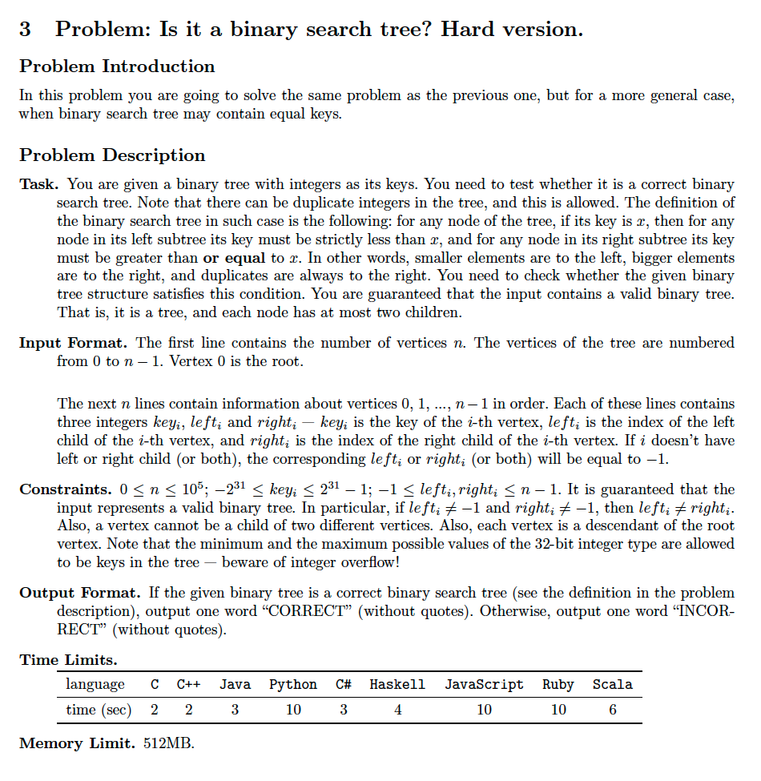
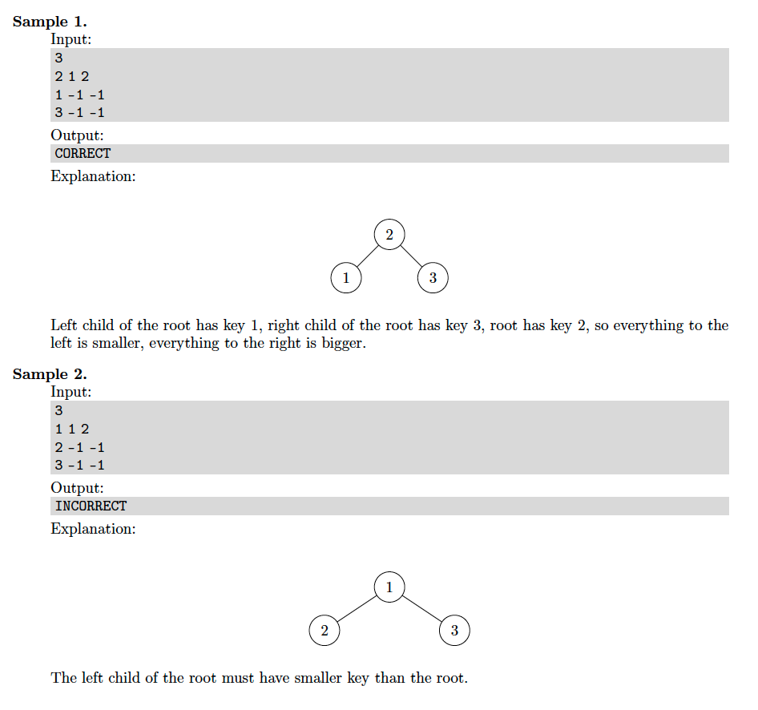
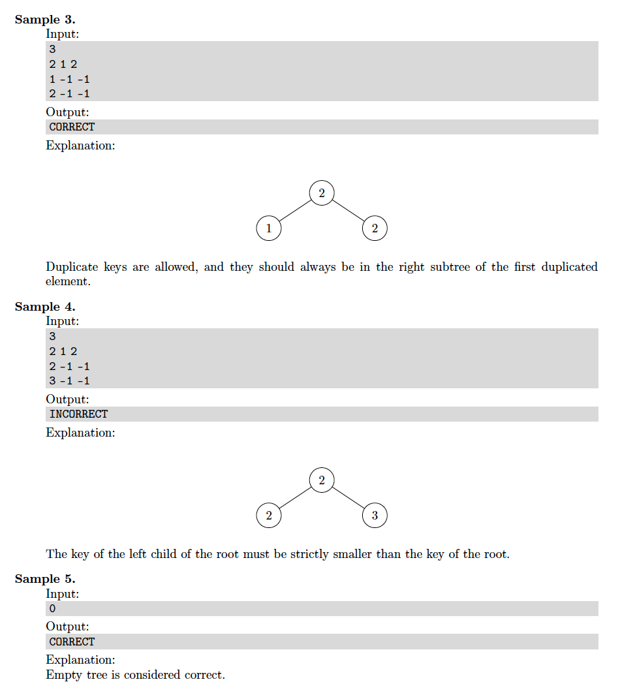

# 3. Is Binary Search Tree (duplicate values)
* [https://en.wikipedia.org/wiki/Binary_search_tree](https://en.wikipedia.org/wiki/Binary_search_tree)

## Problem





## Solutions
* [C++](#cpp)

### CPP
```cpp
    #include <iostream>
    #include <sstream>
    #include <vector>
    #include <memory>
    #include <iterator>
    #include <algorithm>
    #include <limits>
    #include <unordered_set>

    using namespace std;

    using Type = long long;
    constexpr Type INF = numeric_limits< Type >::max();

    struct TreeNode;
    using HTreeNode = shared_ptr< TreeNode >;
    struct TreeNode {
        Type val, min, max;
        HTreeNode left, right;
        TreeNode( Type val, Type min=-INF, Type max=INF )
            : val{ val }, min{ min }, max{ max }, left{ nullptr }, right{ nullptr } {}
        friend ostream& operator<<( ostream& os, const HTreeNode& node ){
            if( node )
                os << node->val;
            return os;
        }
    };
    bool operator<( const HTreeNode& lhs, const HTreeNode& rhs ){
        return lhs->val < rhs->val;
    }
    using Collection = vector< HTreeNode >;

    namespace failed_case_40_of_95_unknown_signal_11 { // stack overflow
        class Solution {
        public:
            bool isBST( HTreeNode root ){
                auto ok{ true };
                if( root )
                    go( root, ok );
                return ok;
            }
        private:
            using MinMax = pair< Type,Type >;
            MinMax go( HTreeNode root, bool& ok ){
                if( ! ok )
                    return{ 0,0 };
                if( ! root->left && ! root->right )
                    return{ root->val, root->val };
                auto[ L1, L2 ] = root->left?  go( root->left,  ok ) : make_pair( root->val, root->val );
                auto[ R1, R2 ] = root->right? go( root->right, ok ) : make_pair( root->val, root->val );
                if( root->left && max( L1, L2 ) >= root->val )
                    ok = false;
                if( root->right && root->val > min( R1, R2 ) )
                    ok = false;
                return{  max({ root->val, L1, L2, R1, R2 }),
                         min({ root->val, L1, L2, R1, R2 })  };
            }
        };
    } // namespace failed_case_40_of_95_unknown_signal_11

    namespace failed_case_44_of_95_unknown_signal_11 { // stack overflow
        class Solution {
        public:
            bool isBST( HTreeNode root, Type min=numeric_limits< Type >::min(), Type max=numeric_limits< Type >::max() ){
                return go( root, min, max );
            }
        private:
            bool go( HTreeNode root, Type min, Type max ){
                if( ! root )
                    return true;
                if( min > root->val || root->val >= max )
                    return false;
                return go( root->left, min, root->val ) &&
                       go( root->right, root->val, max );
            }
        };
    } // namespace failed_case_44_of_95_unknown_signal_11

    class Solution {
    public:
        bool isBST( HTreeNode node, Collection stack={} ){ // iterative pre-order traversal
            if( node )
                stack.push_back( node );
            while( ! stack.empty() ){
                node = stack.back(), stack.pop_back();
                if( node->min > node->val || node->val >= node->max )
                    return false;
                if( node->right ){ // push right child to stack first, so left child is processed first
                    node->right->min = node->val;
                    node->right->max = node->max;
                    stack.push_back( node->right );
                }
                if( node->left ){
                    node->left->min = node->min;
                    node->left->max = node->val;
                    stack.push_back( node->left );
                }
            }
            return true;
        }
    };

    int main() {
        string line;
        auto N{ 0 }; {
            getline( cin, line );
            istringstream is{ line };
            is >> N;
        }
        Collection A;
        generate_n( back_inserter( A ), N, [](){ return make_shared< TreeNode >( 0 ); });
        for( auto i{ 0 }; i < N && getline( cin, line ); ++i ){
            istringstream parser{ line };
            auto val{ 0 }, L{ 0 }, R{ 0 };
            parser >> val >> L >> R;
            A[ i ]->val = val;
            A[ i ]->left =  ( -1 < L )? A[ L ] : nullptr;
            A[ i ]->right = ( -1 < R )? A[ R ] : nullptr;
        }
        auto ok = A.empty() || Solution().isBST( A[ 0 ] );
        cout << ( ok? "CORRECT" : "INCORRECT" ) << endl;
        return 0;
    }
```
