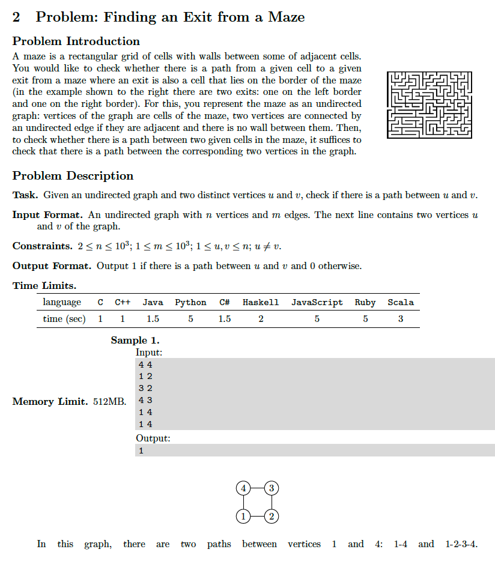

# 2. Reachability
* [https://en.wikipedia.org/wiki/Breadth-first_search](https://en.wikipedia.org/wiki/Breadth-first_search)

## Problem



## Solutions
* [C++](#cpp)

### CPP
```cpp
    #include <iostream>
    #include <sstream>
    #include <unordered_map>
    #include <unordered_set>
    #include <queue>
    
    using namespace std;
    using Vertex = int;
    using Graph = unordered_map< Vertex, unordered_set< Vertex > >;
    using Queue = queue< Vertex >;
    using Seen = unordered_set< Vertex >;
    
    int main() {
        auto N{ 0 }, M{ 0 }; cin >> N >> M;
        Vertex u{ 0 }, v{ 0 };
        Graph G;
        while( 0 < M-- && cin >> u >> v ){
            G[ u ].insert( v );
            G[ v ].insert( u );
        }
        auto start{ 0 }, target{ 0 };
        cin >> start >> target;
        Seen seen{ start };
        for( Queue q{{ start }}; ! q.empty(); ){
            for( auto K = q.size(); K--; ){
                u = q.front(), q.pop();
                if( u == target ){
                    cout << 1 << endl;
                    return 0;
                }
                for( auto v: G[ u ] )
                    if( seen.insert( v ).second )
                        q.push( v );
            }
        }
        cout << 0 << endl;
        return 0;
    }
```
