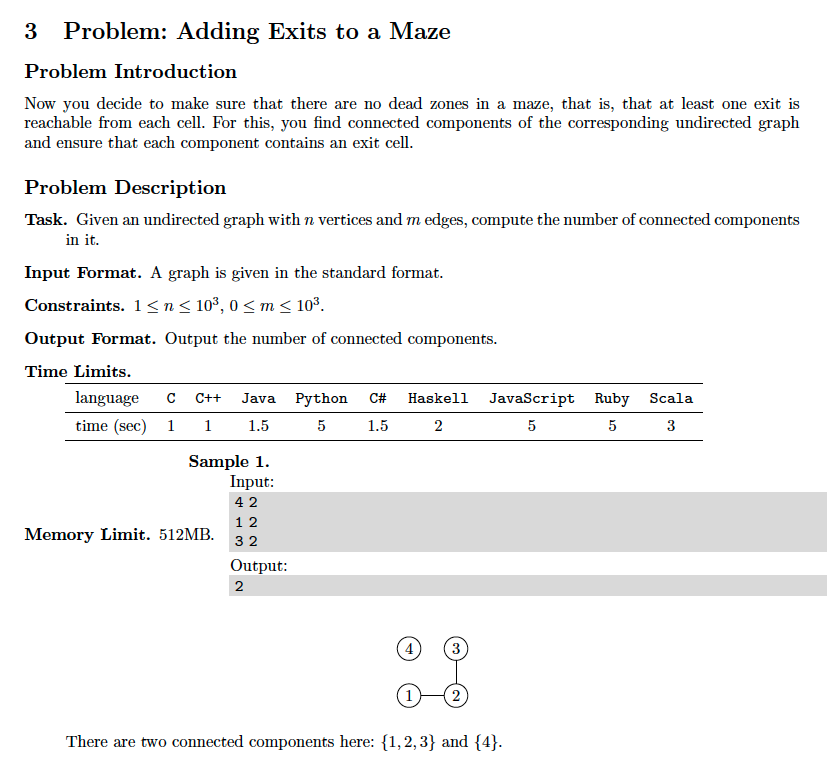

# 3. Connected Components
* [https://en.wikipedia.org/wiki/Depth-first_search](https://en.wikipedia.org/wiki/Depth-first_search)

## Problem


## Solutions
* [C++](#cpp)

### CPP
```cpp
    #include <iostream>
    #include <sstream>
    #include <vector>
    #include <unordered_map>
    #include <unordered_set>
    
    using namespace std;
    using Vertex = int;
    using Graph = unordered_map< Vertex, unordered_set< Vertex > >;
    using Seen = unordered_set< Vertex >;
    using Component = unordered_set< Vertex >;
    using Components = vector< Component >;
    
    void dfs( Graph& G, Vertex u, Component& c, Seen& s ){
        c.insert( u );
        for( auto v: G[ u ] )
            if( s.insert( v ).second )
                dfs( G, v, c, s );
    }
    
    int main() {
        auto N{ 0 }, M{ 0 }; cin >> N >> M;
        Graph G;
        for( Vertex u{ 0 }, v{ 0 }; M-- && cin >> u >> v; ){
            G[ u ].insert( v );
            G[ v ].insert( u );
        }
        Components CC; // (C)onnected (C)omponents
        Seen S;
        for( Vertex u{ 1 }; u <= N; ++u ){
            if( S.insert( u ).second ){
                Component c;
                dfs( G, u, c, S );
                CC.emplace_back( c );
            }
        }
        cout << CC.size() << endl;
        return 0;
    }
```
