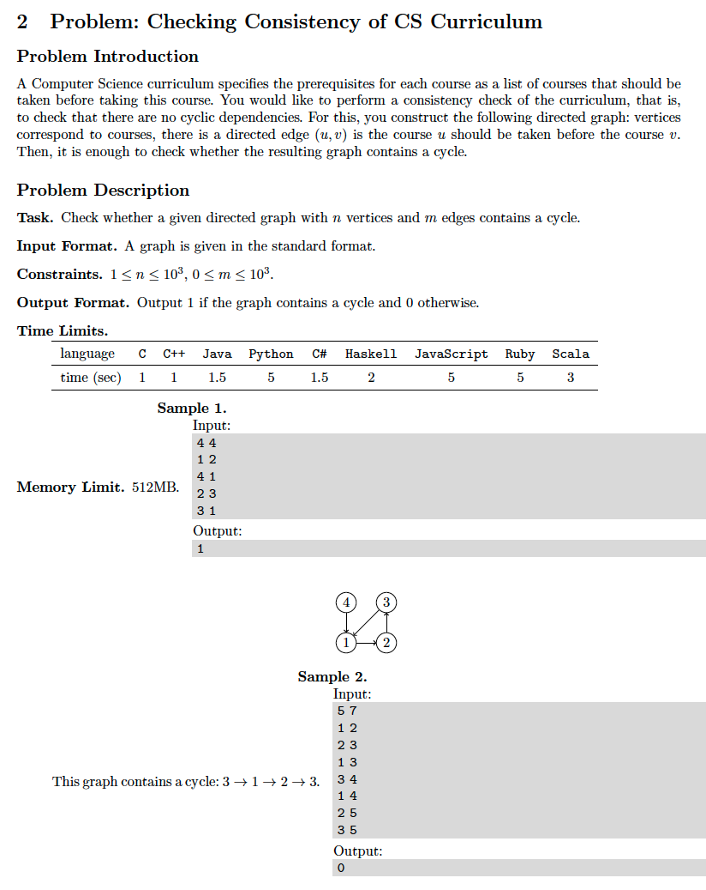

# 2. Directed Acyclic Graphs
* [https://en.wikipedia.org/wiki/Directed_acyclic_graph](https://en.wikipedia.org/wiki/Directed_acyclic_graph)

## Problem



## Solutions
* [C++](#cpp)

### CPP
```cpp
    #include <iostream>
    #include <iostream>
    #include <sstream>
    #include <unordered_map>
    #include <unordered_set>
    #include <vector>
    #include <queue>
    #include <numeric>
    
    using namespace std;
    using Vertex = int;
    using Graph = unordered_map< Vertex, unordered_set< Vertex > >;
    using Seen = unordered_set< Vertex >;
    using InDegree = vector< Vertex >;
    using Queue = queue< Vertex >;
    
    int main() {
        auto N{ 0 }, M{ 0 }; cin >> N >> M;
        Queue q;
        Graph G;
        InDegree D( N+1 ); // +1 for 1-based index BFS pruning
        for( Vertex u{ 0 }, v{ 0 }; M--; ){
            cin >> u >> v;
            G[ u ].insert( v );
            ++D[ v ];
        }
        for( auto i{ 1 }; i <= N; ++i )
            if( D[ i ] == 0 )
                q.push( i );
        for( Vertex u{ 0 }, v{ 0 }; ! q.empty(); ){
            u = q.front(), q.pop();
            for( auto v: G[ u ] )
                if( --D[ v ] == 0 )
                    q.push( v );
        }
        auto ans = 0 < accumulate( D.begin(), D.end(), 0 ); // (ans)wer == 1 iff (G)raph contains a cycle
        cout << ans << endl;
        return 0;
    }
```
