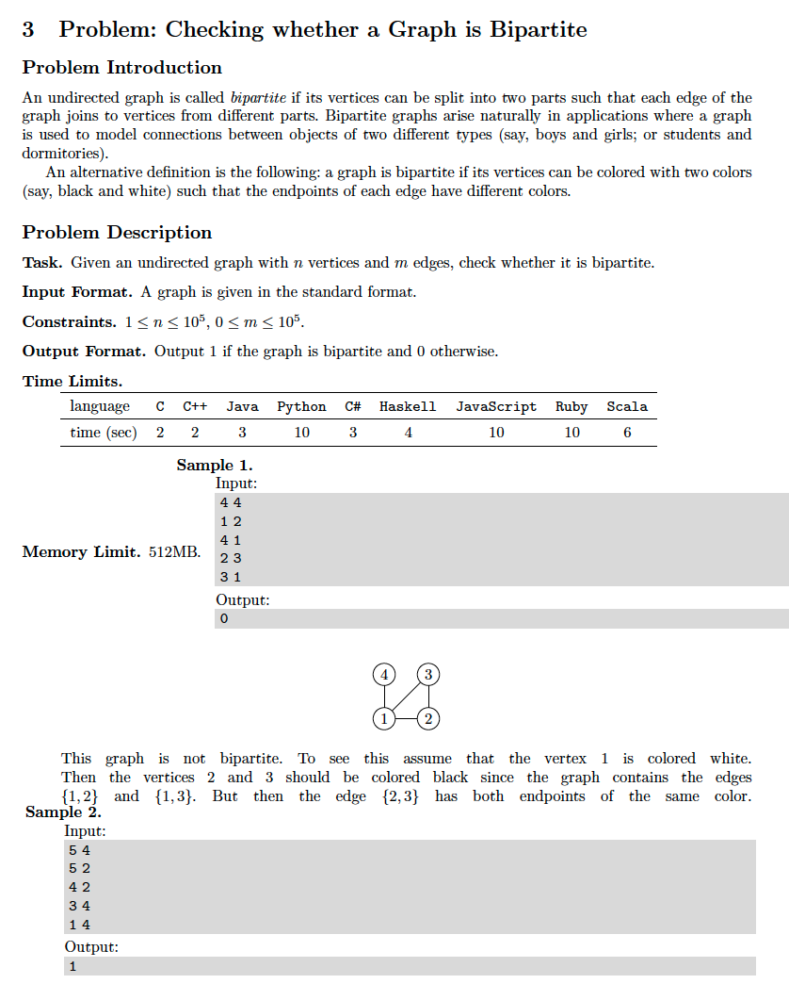

# 3. Bipartite Graph
* [https://en.wikipedia.org/wiki/Bipartite_graph](https://en.wikipedia.org/wiki/Bipartite_graph)

## Problem



## Solutions
* [C++](#cpp)

### CPP
```cpp
    #include <iostream>
    #include <unordered_map>
    #include <unordered_set>
    #include <vector>
    #include <queue>
    
    using namespace std;
    using Vertex = int;
    using Graph = unordered_map< Vertex, unordered_set< Vertex > >;
    using Seen = unordered_set< Vertex >;
    using Queue = queue< Vertex >;
    using Color = vector< int >;
    
    int main() {
        auto N{ 0 }, M{ 0 }; cin >> N >> M;
        Graph G;
        for( Vertex u{ 0 }, v{ 0 }; M-- && cin >> u >> v; ){
            G[ u ].insert( v );
            G[ v ].insert( u );
        }
        Color color( N+1, -1 ); // +1 for 1-based index
        Queue q{{ 1 }};
        Seen seen{ 1 };
        color[ 1 ] = 1;
        for( Vertex u{ 0 }, v{ 0 }; ! q.empty();  ){
            u = q.front(), q.pop();
            for( auto v: G[ u ] ){
                if( seen.insert( v ).second ){
                    q.push( v );
                    color[ v ] = color[ u ] ^ 1;
                } else if( color[ u ] == color[ v ] ){
                    cout << 0 << endl;
                    return 0;
                }
            }
        }
        cout << 1 << endl;
        return 0;
    }
```
