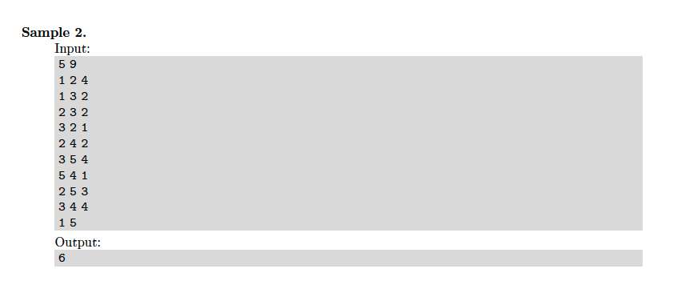
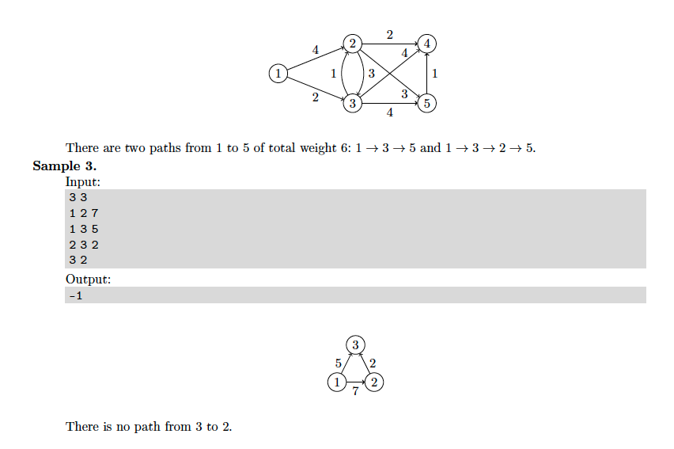

# 2. Dijkstra
* [https://en.wikipedia.org/wiki/Dijkstra%27s_algorithm](https://en.wikipedia.org/wiki/Dijkstra%27s_algorithm)

## Problem




## Solutions
* [C++](#cpp)

### CPP
```cpp
    #include <iostream>
    #include <unordered_map>
    #include <unordered_set>
    #include <queue>
    
    #define LEGACY_COMPILER // needed for legacy compilers which are unable to construct an ephemeral r-value from an initializer list
    
    using namespace std;
    using Vertex = int; using Weight = int;
    using Graph = unordered_map< Vertex, unordered_set< Vertex > >;
    using Distance = vector< Weight >;
    struct VertexWeight {
        Vertex vertex{ 0 }; Weight weight{ 0 };
        VertexWeight( Vertex vertex_, Weight weight_ ) : vertex{ vertex_ }, weight{ weight_ } {}
    };
    struct Compare { bool operator()( const VertexWeight& lhs, const VertexWeight& rhs ) const { return lhs.weight > rhs.weight; } };
    using Queue = priority_queue< VertexWeight, vector< VertexWeight >, Compare >;
    struct Edge {
        Vertex u{ 0 }, v{ 0 };
        Edge( Vertex u_, Vertex v_ ) : u{ u_ }, v{ v_ } {}
        bool operator==( const Edge& rhs ) const { return u == rhs.u && v == rhs.v; }
    };
    constexpr int INF = int( 1e4+1 );
    struct Hash { size_t operator()( const Edge& e ) const { return ( e.u * INF ) + e.v; } };
    using Edges = unordered_map< Edge, Weight, Hash >;
    
    #ifndef LEGACY_COMPILER
    int main() {
        auto N{ 0 }, M{ 0 }; cin >> N >> M;
        Graph G;
        Edges E;
        for( Vertex u{ 0 }, v{ 0 }, w{ 0 }; M-- && cin >> u >> v >> w; ){
            G[ u ].insert( v );
            E[{ u,v }] = w;
        }
        Distance D( N+1, INF ); // +1 for 1-based indexing
        auto start{ 0 }, target{ 0 }; cin >> start >> target;
        D[ start ] = 0;
        Queue q;
        q.push({ start, 0 });
        for( Vertex u{ 0 }; ! q.empty(); ){
            u = q.top().vertex, q.pop();
            if( u == target ){
                cout << D[ u ] << endl;
                return 0;
            }
            for( auto v: G[ u ] ){
                auto w = D[ u ] + E[{ u,v }];
                if( D[ v ] > w ){
                    D[ v ] = w;
                    q.push({ v,w });
                }
            }
        }
        cout << -1 << endl;
        return 0;
    }
    #else
    int main() {
        auto N{ 0 }, M{ 0 }; cin >> N >> M;
        Graph G;
        Edges E;
        for( Vertex u{ 0 }, v{ 0 }, w{ 0 }; M-- && cin >> u >> v >> w; ){
            G[ u ].insert( v );
            E[Edge( u,v )] = w;
        }
        Distance D( N+1, INF ); // +1 for 1-based indexing
        auto start{ 0 }, target{ 0 }; cin >> start >> target;
        D[ start ] = 0;
        Queue q;
        q.push(VertexWeight( start, 0 ));
        for( Vertex u{ 0 }; ! q.empty(); ){
            u = q.top().vertex, q.pop();
            if( u == target ){
                cout << D[ u ] << endl;
                return 0;
            }
            for( auto v: G[ u ] ){
                auto w = D[ u ] + E[Edge( u,v )];
                if( D[ v ] > w ){
                    D[ v ] = w;
                    q.push({ v,w });
                }
            }
        }
        cout << -1 << endl;
        return 0;
    }
    #endif
```
