# Counting Sort (detailed pseudocode)
* [https://en.wikipedia.org/wiki/Counting_sort](https://en.wikipedia.org/wiki/Counting_sort)

## Verbose Pseudocode


```cpp
    #include <iomanip>
    #include <iostream>
    #include <sstream>
    #include <algorithm>
    #include <iterator>
    #include <vector>
    #include <string>
    #include <cassert>
    
    #define OUTPUT_ORDER
    #define OUTPUT_EQUIVALENCE_CLASS
    #define OUTPUT_START
    #define OUTPUT_NEW_ORDER
    #define OUTPUT_NEW_EQUIVALENCE_CLASS
    
    using namespace std;
    using Collection = vector< int >;
    using Count = Collection;
    using EquivalenceClass = Collection;
    using Order = Collection;
    using Start = Collection;
    
    int main() {
        /*
         * class   character
         * -----   ---------
         *     0   $
         *     1   a
         *     2   b
         */
        const string S{ "ababaa$" }; const auto N = static_cast< int >( S.size() ), L = 1;
        //               ^^^^^^^  ---->  a b a b a a $
        //      EquivalenceClass eClass{ 1,2,1,2,1,1,0 }; // commented out because this is derived below w/ counting sort
        /*
         * * * * * * * * * * * * * * * * * * * * * * * * * * * * * * * * * * * * * * * * * * * * * * * * * * * * * * * *
         *
         * IMPORTANT NOTE: in this example 'order' is the count sort of single characters of the original string S,
         *                 DO NOT confuse this with the suffix array 'order', which is different!
         *
         * * * * * * * * * * * * * * * * * * * * * * * * * * * * * * * * * * * * * * * * * * * * * * * * * * * * * * * *
         *
         *  recall: suffix array 'order' == begin index of the ordered suffixes of the original string S
         *
         *  order   suffix
         *  -----   ------
         *      6   $
         *      5   a$
         *      4   aa$
         *      2   abaa$
         *      0   ababaa$
         *      3   baa$
         *      1   babaa$
         *
         *  Order order{ 6,5,4,2,0,3,1 }; // <-- suffix array 'order' ( this is NOT used in this example !!! )
         *               $ a a a a b b
         *                 $ a b b a a
         *                   $ a a a b
         *                     a b $ a
         *                     $ a   a
         *                       a   $
         *                       $
         */
         
```
## Initialization Phase

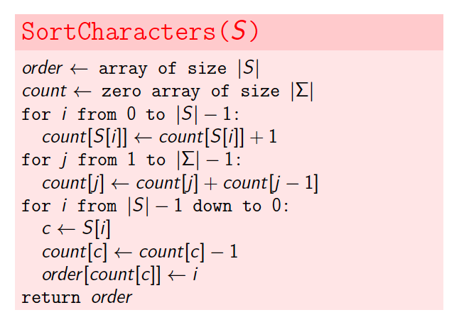
```
        Order order( N ); { // the order of single characters of the original string S
            /*
             * compute a histogram of the number of times each key occurs within the original string S
             */
            Count count( 123, 0 ); // 123 == 'z' + 1  ( +1 for 'a' through 'z' inclusive -- this was an arbitrary choice for the alphabet )
            for( auto i{ 0 }; i < N; ++i ){
                auto ch = S[ i ];
                count[ ch ] = count[ ch ] + 1;
            }
            /*
             * count[ '$' ] = 1
             * count[ 'a' ] = 4
             * count[ 'b' ] = 2
             */
            /*
             * prefix sum computation on count to determine, for each key,
             * the position range where the items having that key should be placed in;
             * i.e. items of key i should be placed in the range of [ count{ i-1 } : count{ i } )
             * i.e. the range exists from count[ i-1 ] inclusive to count[ i ] non-inclusive ( one-past the actual range )
             */
            for( auto j{ 1 }; j < 123; ++j )
                count[ j ] = count[ j ] + count[ j-1 ]; // offset current count relative to previous count's offset
            /*
             * count[ '$' ] = 1  <--  count[ '$' ] = 1 offset by 0
             * count[ 'a' ] = 5  <--  count[ 'a' ] = 4 offset by 1
             * count[ 'b' ] = 7  <--  count[ 'b' ] = 2 offset by 5
             */
```
## Quiz Question
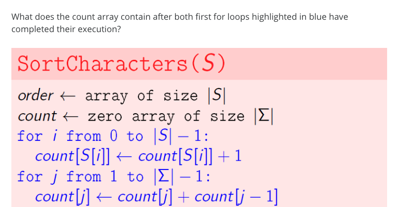
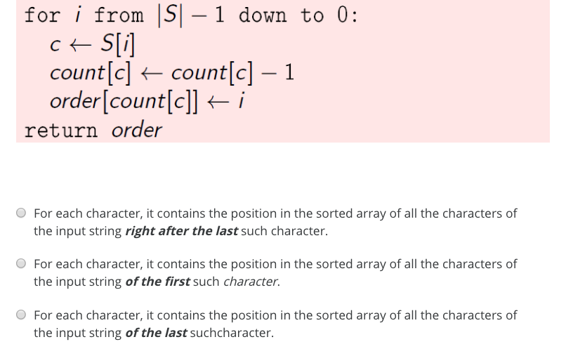

## Quiz Answer

```
            /*
             * move each (i)ndex into its sorted position
             * NOTE: count[ ch ] is originally non-inclusive of the range (i)ndex will be placed witihin
             *       ( i.e. the value of count[ ch ] is one-past the actual range )
             *       that is why count[ ch ] is decremented before the (i)ndex is placed into that corresponding position
             */
            for( auto i{ N-1 }; 0 <= i; --i ){
                auto ch = S[ i ];
                count[ ch ] = count[ ch ] - 1;
                order[ count[ ch ] ] = i;
            }
        }
        string order_str; {
            ostringstream os;
            os << "Order: "; copy( order.begin(), order.end(), ostream_iterator< int >( os, " " ) ); os << endl;
            order_str = os.str();
            assert( order_str == "Order: 6 0 2 4 5 1 3 \n" );
    #ifdef OUTPUT_ORDER
            cout << order_str << endl;
    #endif
        }
```
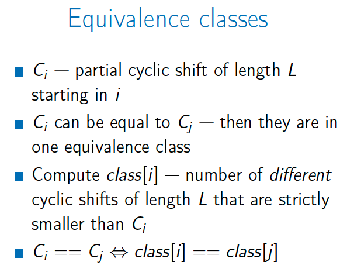

             
```     
        EquivalenceClass eClass( N ); {
            eClass[ order[ 0 ] ] = 0;  // '$' is always order[ 0 ], thus eClass[ '$' ] = 0 as the base case of the recurrence formula
            for( auto i{ 1 }; i < N; ++i )
                if( S[ order[ i ] ] != S[ order[ i-1 ] ] )
                    eClass[ order[ i ] ] = eClass[ order[ i-1 ] ] + 1;  // diff equivalence class
                else
                    eClass[ order[ i ] ] = eClass[ order[ i-1 ] ];      // same equivalence class
        }
        string eClass_str; {
            ostringstream os;
            os << "Class: "; copy( eClass.begin(), eClass.end(), ostream_iterator< int >( os, " " ) ); os << endl;
            eClass_str = os.str();
            assert( eClass_str == "Class: 1 2 1 2 1 1 0 \n" );
    #ifdef OUTPUT_EQUIVALENCE_CLASS
            cout << eClass_str << endl;
    #endif
        }
```

## Transition Phase
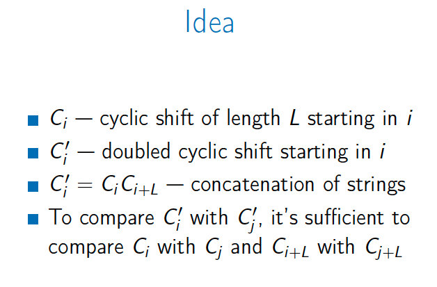
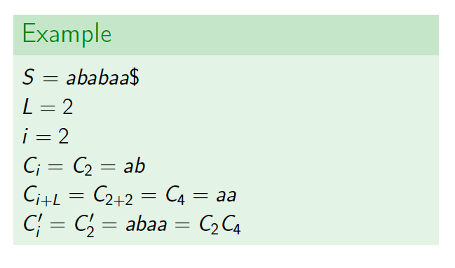
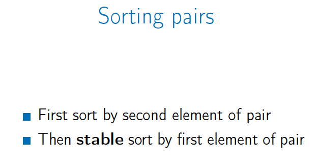


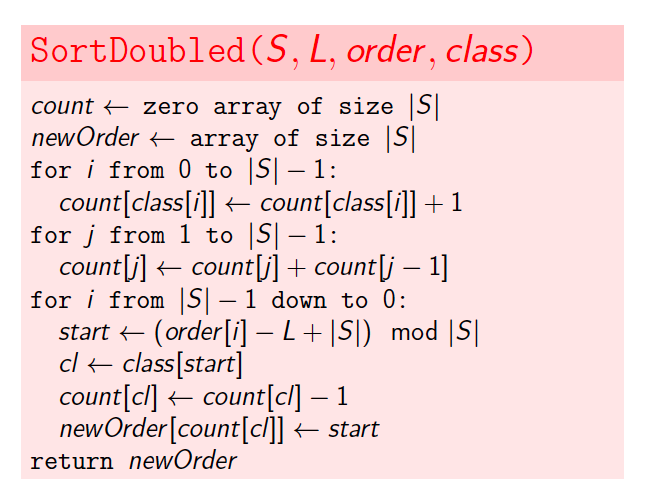
```
        Count count( 123, 0 ); {
            for( auto i{ 0 }; i < N; ++i ){
                auto cl = eClass[ i ];
                count[ cl ] = count[ cl ] + 1;
            }
            for( auto j{ 1 }; j < 123; ++j )
                count[ j ] = count[ j ] + count[ j-1 ];
        }
        Start start( N ); {
            for( auto i{ N-1 }; 0 <= i; --i )
                start[ i ] = ( order[ i ] - L + N ) % N;
        }
        string start_str; {
            ostringstream os;
            os << "Start: "; copy( start.begin(), start.end(), ostream_iterator< int >( os , " " ) ); os << endl;
            start_str = os.str();
            assert( start_str == "Start: 5 6 1 3 4 0 2 \n" );
    #ifdef OUTPUT_START
        cout << start_str << endl;
    #endif
        }
        Order new_order( N ); {
            for( auto i{ N-1 }; 0 <= i; --i ){
                auto cl = eClass[ start[ i ] ];
                count[ cl ] = count[ cl ] - 1;
                new_order[ count[ cl ] ] = start[ i ];
            }
        }
        string new_order_str; {
            ostringstream os;
            os << "New order: "; copy( new_order.begin(), new_order.end(), ostream_iterator< int >( os, " " ) ); os << endl;
            new_order_str = os.str();
            assert( new_order_str == "New order: 6 5 4 0 2 1 3 \n" );
    #ifdef OUTPUT_NEW_ORDER
            cout << new_order_str << endl;
    #endif
        }
        EquivalenceClass new_eClass( N ); {
            new_eClass[ new_order[ 0 ] ] = 0; // "$..." is always order[ 0 ], thus eClass[ "$..." ] = 0 as the base case of the recurrence formula
            for( auto i{ 1 }; i < N; ++i ){
                auto pre = new_order[ i-1 ], preMid = ( pre + L ) % N,
                     cur = new_order[ i   ], curMid = ( cur + L ) % N;
                if( eClass[ pre ] != eClass[ cur ] || eClass[ preMid ] != eClass[ curMid ] )
                    new_eClass[ cur ] = new_eClass[ pre ] + 1;
                else
                    new_eClass[ cur ] = new_eClass[ pre ];
            }
        }
        string new_eClass_str; {
            ostringstream os;
            os << "New class: "; copy( new_eClass.begin(), new_eClass.end(), ostream_iterator< int >( os, " " ) ); os << endl;
            new_eClass_str = os.str();
            assert( new_eClass_str == "New class: 3 4 3 4 2 1 0 \n" );
        }
    #ifdef OUTPUT_NEW_EQUIVALENCE_CLASS
        cout << new_eClass_str << endl;
    #endif
        return 0;
    }
    
```

## Quiz

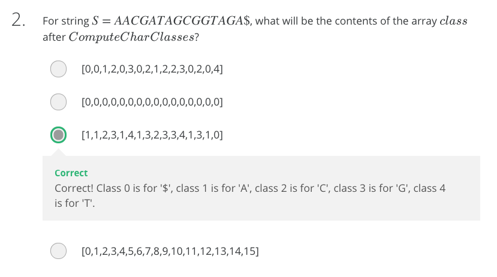
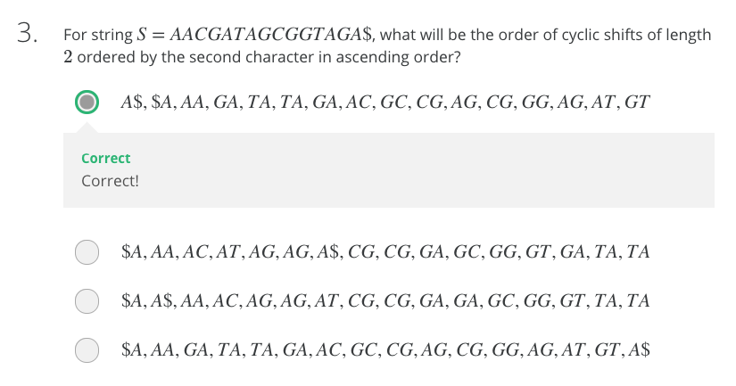
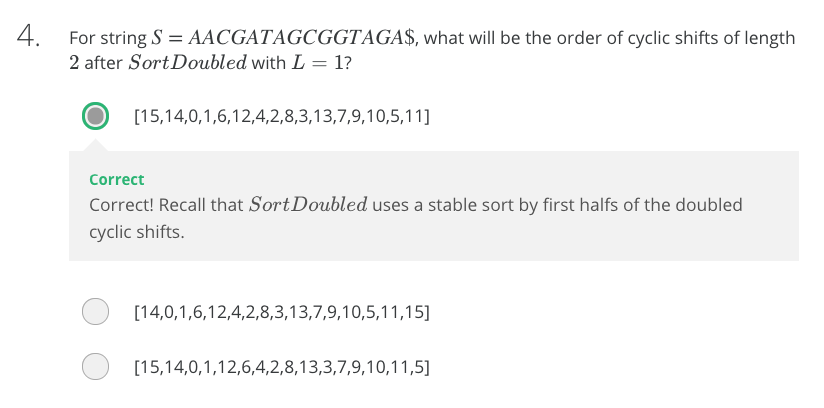
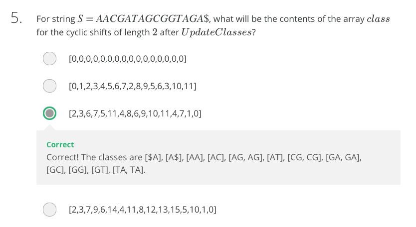
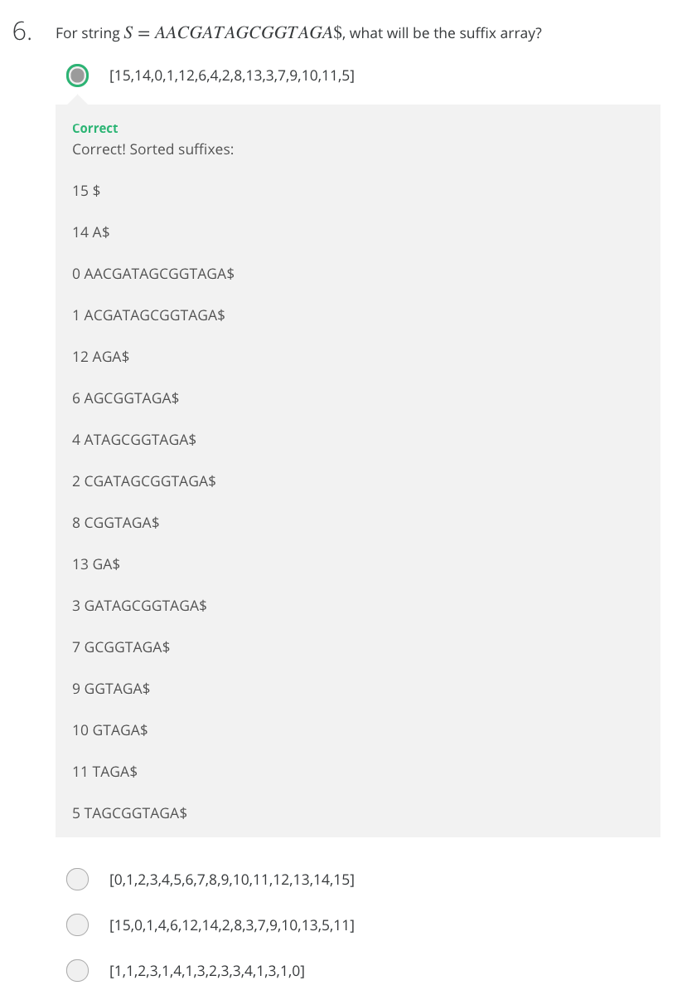
