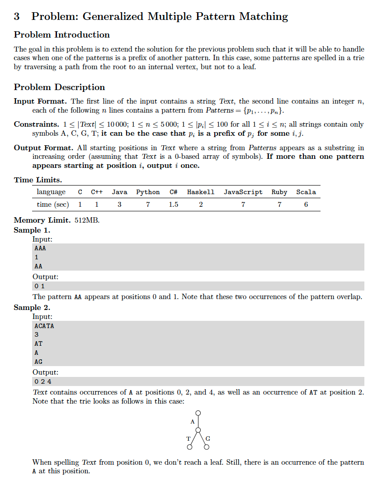

# 3. Trie Pattern Matching (prefix allowed)
* [https://en.wikipedia.org/wiki/Trie](https://en.wikipedia.org/wiki/Trie)

## Problem


## Solutions
* [C++](#cpp)

### CPP
```cpp
    #include <iostream>
    #include <sstream>
    #include <unordered_map>
    #include <memory>
    #include <queue>
    #include <set>
    #include <iterator>
    #include <algorithm>
    
    #define PREFIX_ALLOWED
    
    using namespace std;
    using Positions = set< int >;
    
    class Trie {
    public:
        Trie() : N{ 0 }, root{ next() } {}
        void add( const string& s ){
            auto cur{ root };
            for( auto c: s ){
                auto it = cur->children.find( c );
                if( it != cur->children.end() )
                    cur = it->second;
                else
                    cur = cur->children[ c ] = next();
            }
            cur->children[ '$' ] = next();
        }
        Positions find( const string& s, Positions P={} ) const {
            auto N = s.size();
            for( auto i{ 0 }; i < N; ++i ){
                auto cur{ root };
                for( auto j{ i }; j < N; ++j ){
    #ifdef PREFIX_ALLOWED
                    if( cur->children.find( '$' ) != cur->children.end() )
                        P.insert( i );
    #endif
                    auto c = s[ j ];
                    auto it = cur->children.find( c );
                    if( it != cur->children.end() )
                        cur = it->second;
                    else
                        break;
                }
                if( cur->children.find( '$' ) != cur->children.end() )
                    P.insert( i );
            }
            return P;
        }
    private:
        mutable int N;
        struct Node;
        using HNode = shared_ptr< Node >;
        HNode root;
        struct Node {
            explicit Node( int id_ ) : id{ id_ } {}
            const int id{ 0 };
            using Children = unordered_map< char, HNode >;
            Children children;
        };
        HNode next() const {
            return make_shared< Node >( N++ );
        }
    };
    
    int main() {
        string text; cin >> text;
        auto N{ 0 }; cin >> N;
        Trie T; for( string s; N-- && cin >> s; T.add( s ) );
        auto P = T.find( text );
        copy( P.begin(), P.end(), ostream_iterator< int >( cout, " " ) );
        return 0;
    }
```
