# 1. Burrows-Wheeler Transform
* [https://en.wikipedia.org/wiki/Burrows%E2%80%93Wheeler_transform](https://en.wikipedia.org/wiki/Burrows%E2%80%93Wheeler_transform)

## Lecture
* **Goal**
    * Reduce memory footprint for storing genomes 
* **Strategy**
    * Text compression via run-length encoding ( simple )
* **Summary**
    * Only useful if we can invert this transformation
    * Can we go back from the Burrows-Wheeler Transform of the genome to the orignal genome?

---
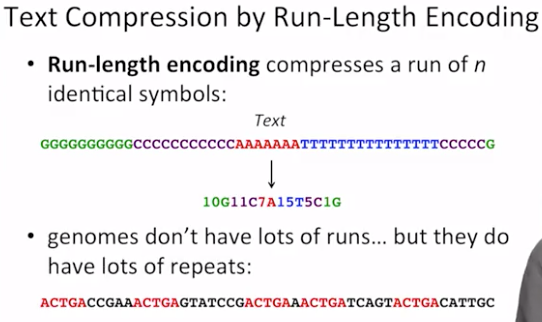
---

---
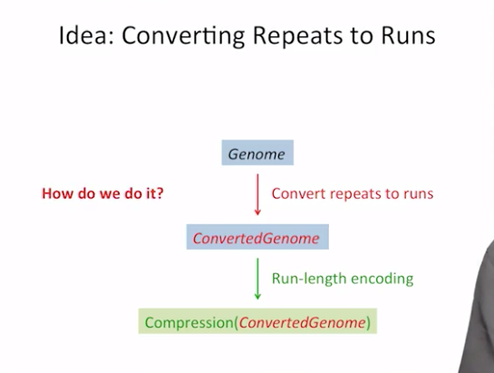
---
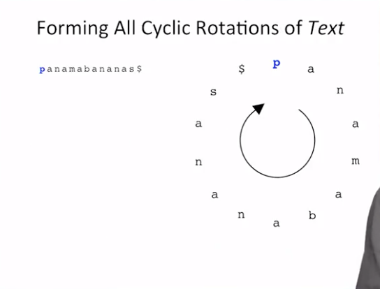
---
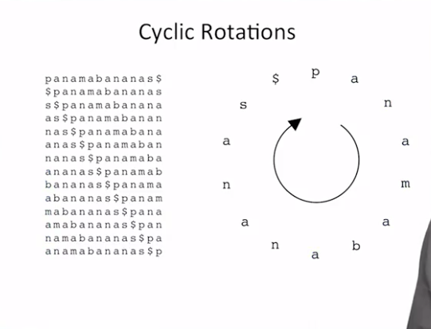
---
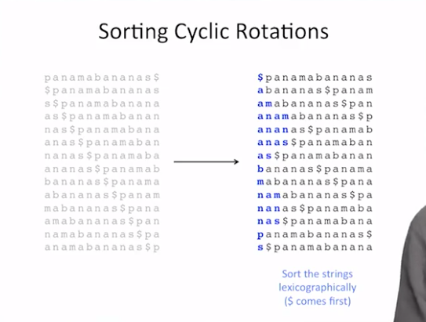
---
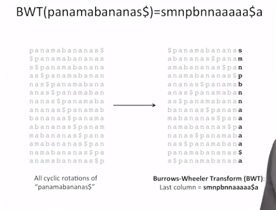
---
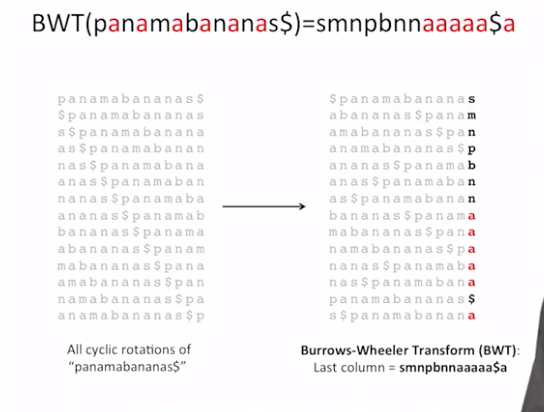
---
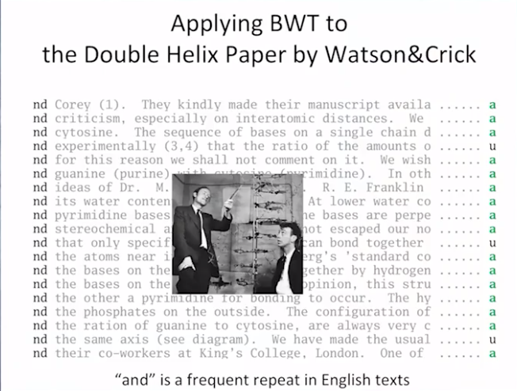
---
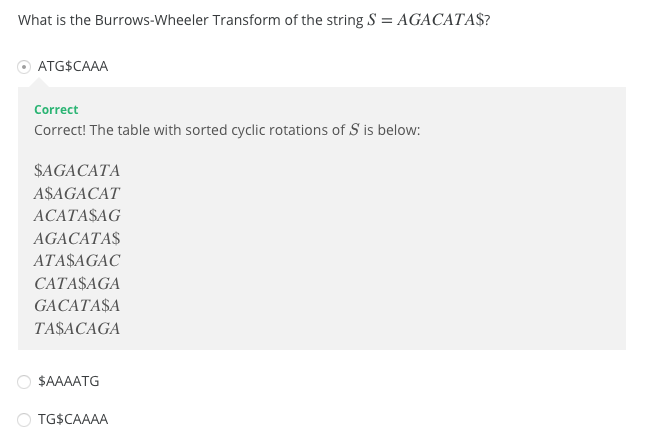
---
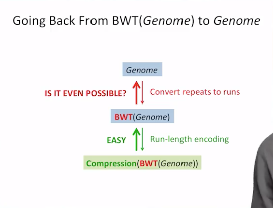

## Problem
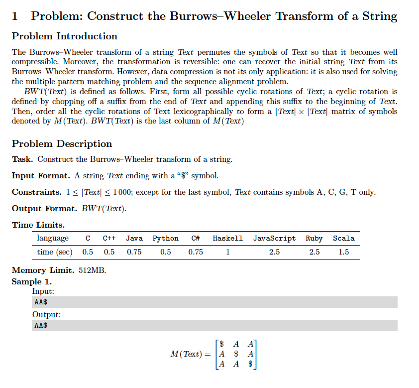
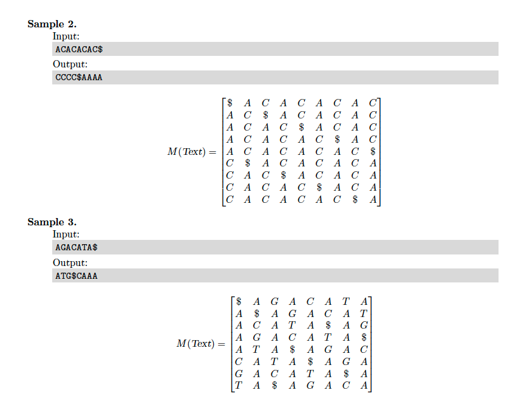

## Pseudocode


## Solutions
* [C++](#cpp)

### CPP
```cpp
    #include <iostream>
    #include <sstream>
    #include <string>
    #include <vector>
    #include <algorithm>
    #include <iterator>
    
    //#define OUTPUT_CYCLIC_ROTATIONS__THE_BURROWS_WHEELER_TRANSFORM_MATRIX
    #define OUTPUT_BURROWS_WHEELER_TRANSFORM
    
    using namespace std;
    using Strings = vector< string >;
    
    int main() {
        Strings S;
        string str; cin >> str;
        for( auto N = str.size(); N--; ){
            rotate( str.begin(), str.begin()+1, str.end() );
            S.push_back( str );
        }
        sort( S.begin(), S.end() );
    #ifdef OUTPUT_CYCLIC_ROTATIONS__THE_BURROWS_WHEELER_TRANSFORM_MATRIX
        copy( S.begin(), S.end(), ostream_iterator< string >( cout, "\n" ) ); cout << endl;
    #endif
    #ifdef OUTPUT_BURROWS_WHEELER_TRANSFORM
        Strings T{ S }; transform( S.begin(), S.end(), T.begin(), []( const auto& str ){ return str.back(); });
        ostringstream os; copy( T.begin(), T.end(), ostream_iterator< string >( os, "" ) );
        cout << os.str() << endl;
    #endif
        return 0;
    }
```
