# 3. Pattern Matching
* [https://en.wikipedia.org/wiki/Burrows-Wheeler_transform](https://en.wikipedia.org/wiki/Burrows-Wheeler_transform)

## Lecture
* **Goal**
    * Suffix Tree is too slow for large text
    * Can we find patterns using the Burrows-Wheeler Transform Matrix **BWT(Text)** in linear time?
    

| Algorithm   | Memory          | Time                 |
|:------------|:----------------|:---------------------|
| Suffix Tree | O( 20 * Text )  | O( Text + Patterns ) |
| BWT(Text)   | O( 2 * Text )   | O( Patterns )        |

* **Summary**
    * We can go back from the Burrows-Wheeler Transform of the genome to the original genome:
    
### Suffix Tree is Too Slow


### BWT for Pattern Matching
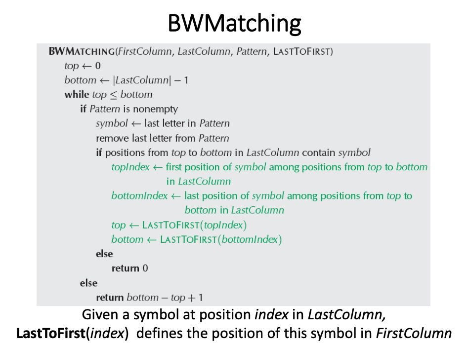

#### Searching for pattern "ana" in text "panamabananas" 
Pattern matching is performed in reverse i.e. from right-to-left.

* *example:* search for **ana** from```L <- R``` inclusive:
```
ana
^ ^
L R
```
##### Using the Burrows-Wheeler Transform's First-Last Property:
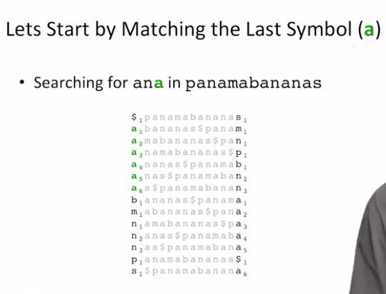
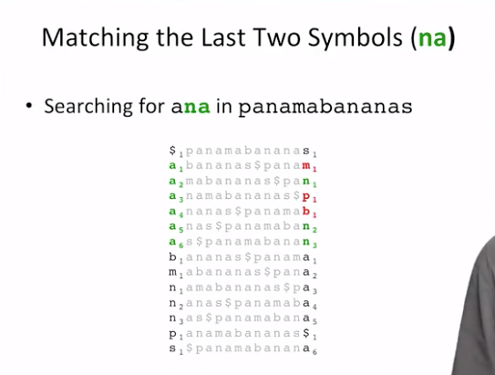
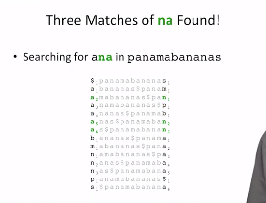

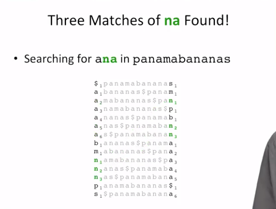

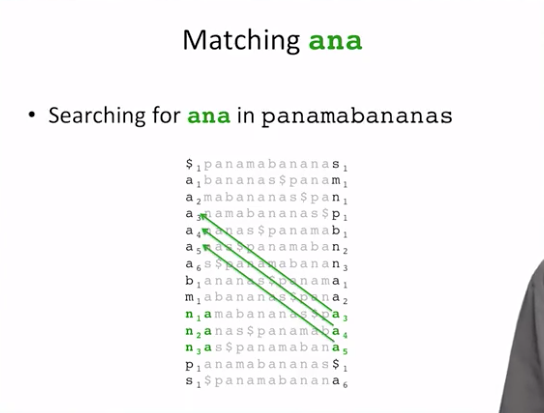
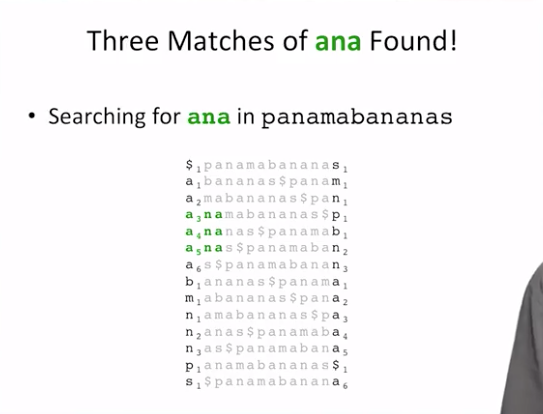

#### BWT Pattern Matching Algorithm
We will use **two pointers**, **top** and **bottom**, that specify the **range
of positions** in the Burrow-Wheelers matrix that we are interested in.
In the **beginning**, top will go to 0 and bottom equal to 13,
to cover **all positions in the text**.
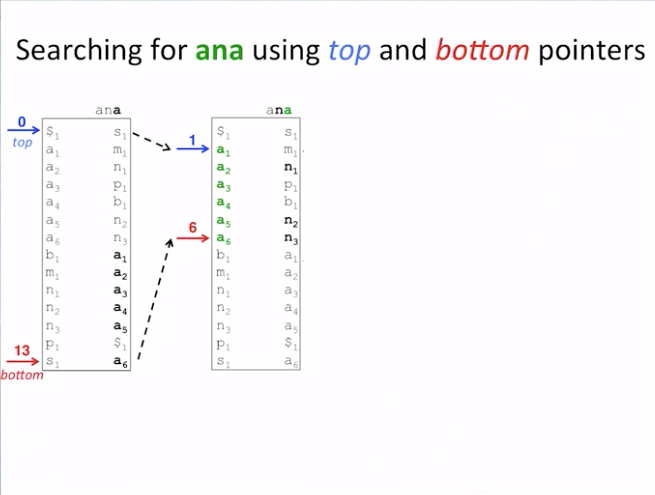


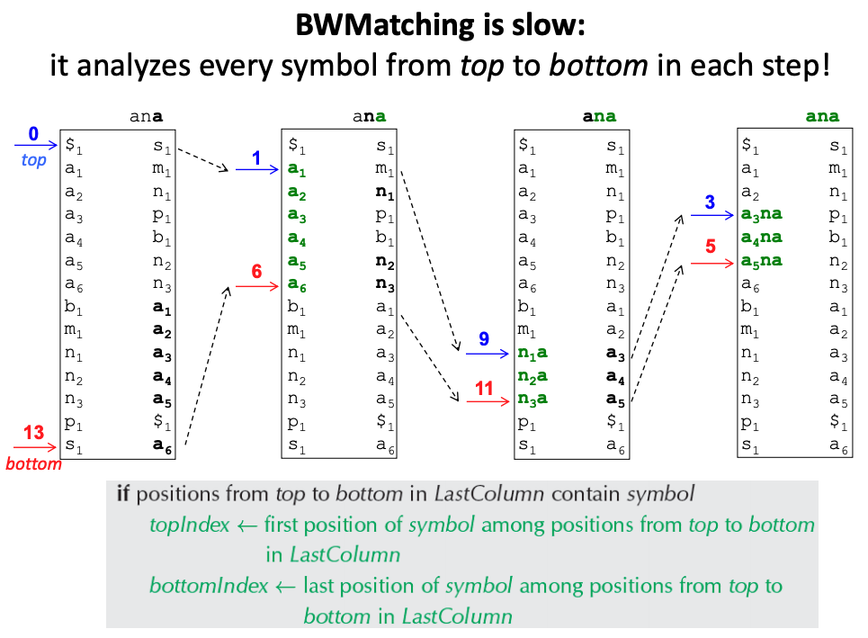

### Better BWT Pattern Matching Algorithm

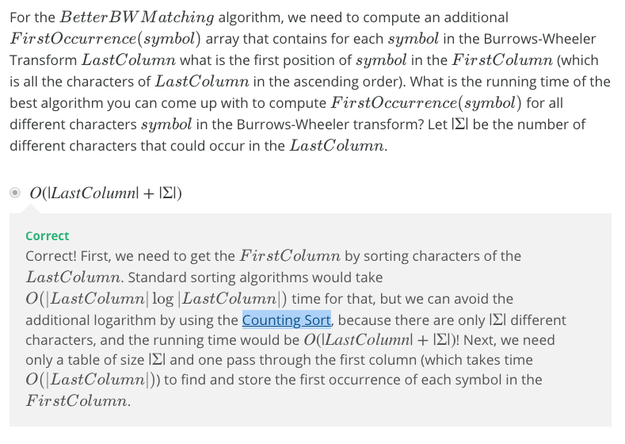

#### Using Counting Sort
We can derive the **First** column from the **Last** column in ```O(|Last|+|ACGT|)``` time,
while standard sorting alogithms would take ```O(|Last|*log|Last|)``` time.

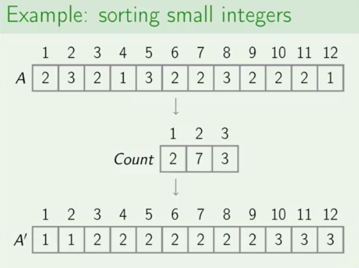
* **Note:** refer to [Non-Comparision Based Sorting Algorithms](https://www.coursera.org/learn/algorithmic-toolbox/lecture/2aCbu/non-comparison-based-sorting-algorithms)
lecure for details

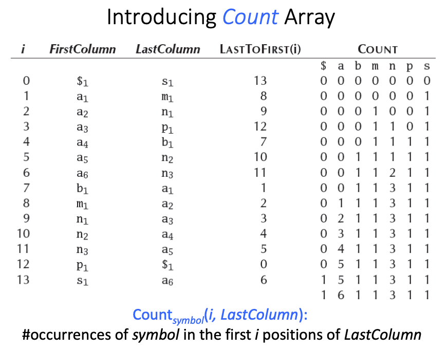

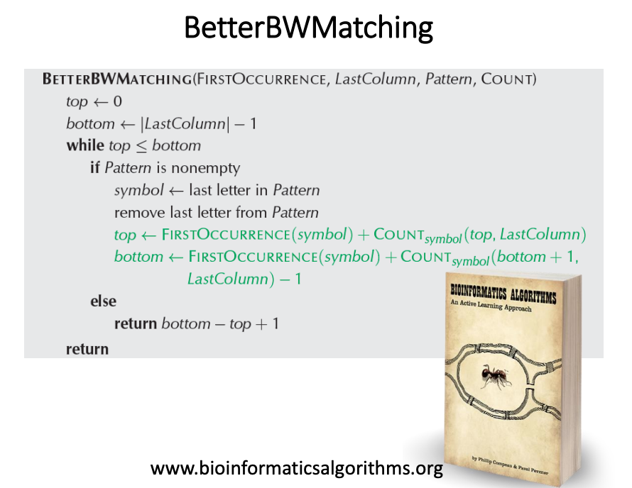

## Problem
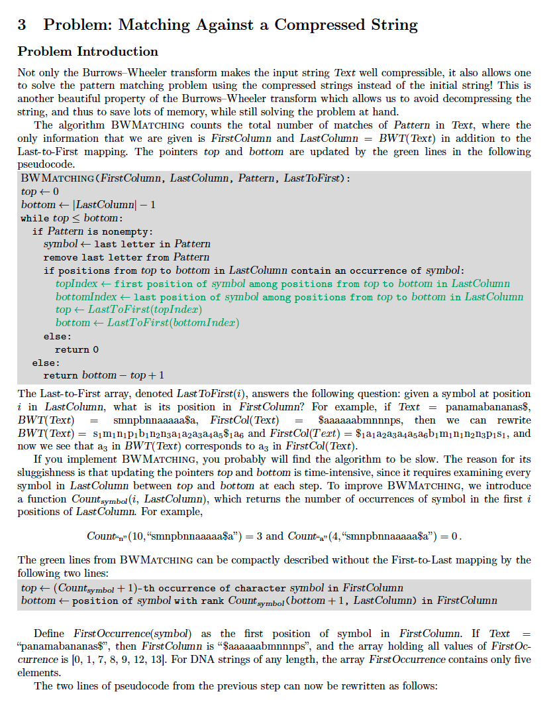
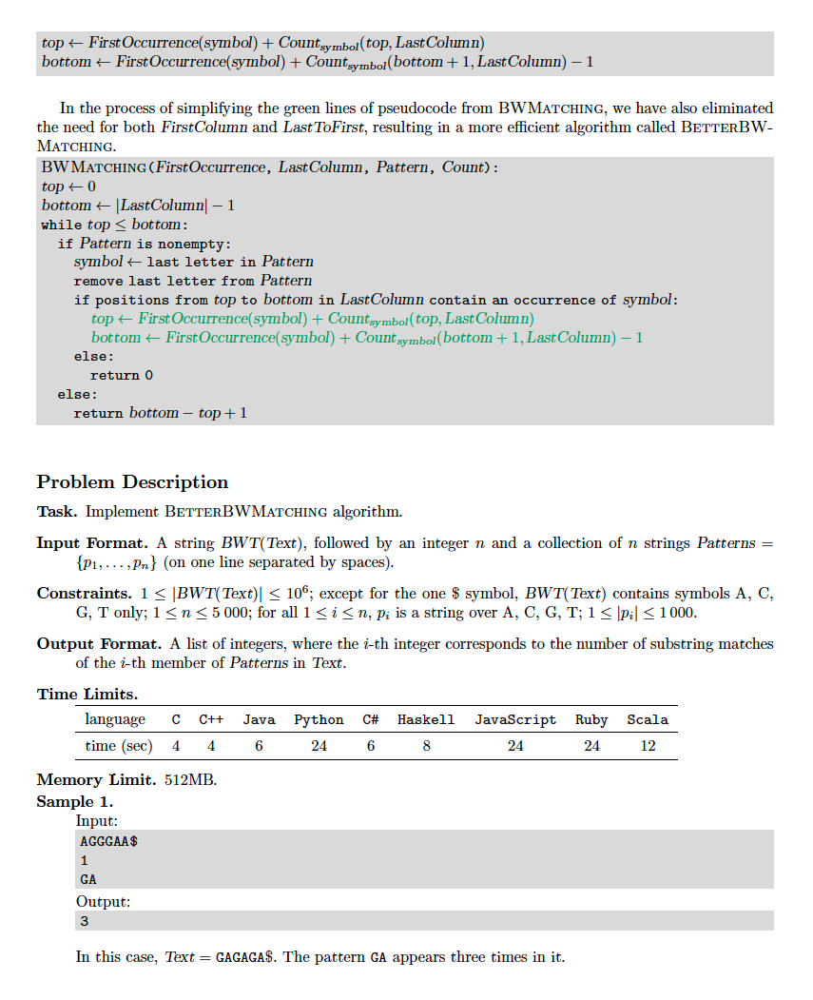
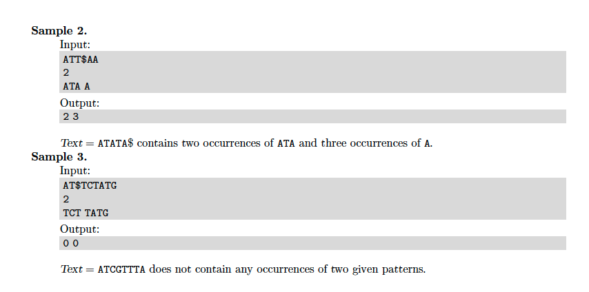


## Solutions
* [C++](#cpp)

### CPP
```cpp
    #include <iostream>
    #include <sstream>
    #include <string>
    #include <vector>
    #include <unordered_map>
    #include <algorithm>
    #include <iterator>
    
    //#define TRIVIAL_IMPLEMENTATION
    
    using namespace std;
    
    #ifdef TRIVIAL_IMPLEMENTATION // Failed case #27/36: time limit exceeded (Time used: 7.99/4.00, memory used: 156905472/536870912.)
    using Patterns = vector< string >;
    using LastToFirst = vector< int >;
    using Counter = unordered_map< char,int >;
    using Matches = vector< int >;
    int main() {
        string last; cin >> last;
        auto first{ last }; sort( first.begin(), first.end() );
        Patterns P; {
            auto M{ 0 }; cin >> M;
            copy_n( istream_iterator< string >( cin ), M, back_inserter( P ) );
        }
        LastToFirst lastToFirst; {
            Counter cnt; for( auto c: last ){ ++cnt[ c ]; }
            auto A{ 1 }, // A == 1 because the first symbol of first column is $ ( since first column is sorted )
                 C{ A + cnt[ 'A' ] },
                 G{ C + cnt[ 'C' ] },
                 T{ G + cnt[ 'G' ] };
            for( auto c: last ){
                switch( c ){
                    case '$': lastToFirst.push_back( 0 ); break; // '$' is alphabetically first in first column ( 0-based index )
                    case 'A': lastToFirst.push_back( A++ ); break;
                    case 'C': lastToFirst.push_back( C++ ); break;
                    case 'G': lastToFirst.push_back( G++ ); break;
                    case 'T': lastToFirst.push_back( T++ ); break;
                }
            }
        }
        Matches matches; {
            const auto N = static_cast< int >( last.size() );
            for( auto pattern: P ){
                for( auto i{ 0 }, j{ N }; i < j; ){
                    if( pattern.empty() ){
                        matches.push_back( j - i ); // the # of occurrences of pattern in text
                        break;
                    }
                    auto target = pattern.back(); pattern.pop_back();
                    auto beg = last.begin() + i,
                         end = last.begin() + j,
                         itr = find( beg, end, target );
                    if( itr == end ){
                        matches.push_back( 0 ); // pattern NOT found in text
                        break;
                    }
                    auto targetIndex = distance( last.begin(), itr );
                    auto cnt = count_if( itr, end, [=]( auto c ){ return c == target; });
                    i = lastToFirst[ targetIndex ];
                    j = i + cnt;
                }
            }
        }
        copy( matches.begin(), matches.end(), ostream_iterator< int >( cout, " " ) );
        return 0;
    }
    #else // BETTER_IMPLEMENTATION
    using Patterns = vector< string >;
    using Counter = unordered_map< char,int >;
    using CountArray = vector< Counter >;
    using FirstOccurrence = unordered_map< char,int >;
    using LastToFirst = vector< int >;
    using Matches = vector< int >;
    constexpr int NOT_FOUND = int( 1e6+1 );
    int main() {
        string last; cin >> last;
        auto first{ last }; sort( first.begin(), first.end() );
        const auto N = static_cast< int >( last.size() );
        Patterns P; {
            auto M{ 0 }; cin >> M;
            copy_n( istream_iterator< string >( cin ), M, back_inserter( P ) );
        }
        CountArray countArray{ { { 'A',0 },{ 'C',0 },{ 'G',0 },{ 'T',0 } } }; {
            for( auto i{ 1 }; i <= N; ++i ){
                auto c = last[ i-1 ];
                auto next = countArray.back();
                if( c != '$' )
                    ++next[ c ];
                countArray.emplace_back( next );
            }
        }
        FirstOccurrence firstOccurrence; {
            for( auto c: string{ "ACGT" } ){
                auto pos = first.find( c );
                firstOccurrence[ c ] = ( pos != string::npos )? pos : NOT_FOUND;
            }
        }
        Matches matches; {
            for( auto pattern: P ){
                bool found{ false };
                for( auto i{ 0 }, j{ N }; i < j; ){
                    if( pattern.empty() ){
                        matches.push_back( j - i ); // the # of occurrences of pattern in text
                        found = true;
                        break;
                    }
                    auto target = pattern.back(); pattern.pop_back();
                    if( firstOccurrence[ target ] == NOT_FOUND )
                        break;
                    i = firstOccurrence[ target ] + countArray[ i ][ target ];
                    j = firstOccurrence[ target ] + countArray[ j ][ target ];
                }
                if( ! found )
                    matches.push_back( 0 );
            }
        }
        copy( matches.begin(), matches.end(), ostream_iterator< int >( cout, " " ) );
        return 0;
    }
    #endif
```
