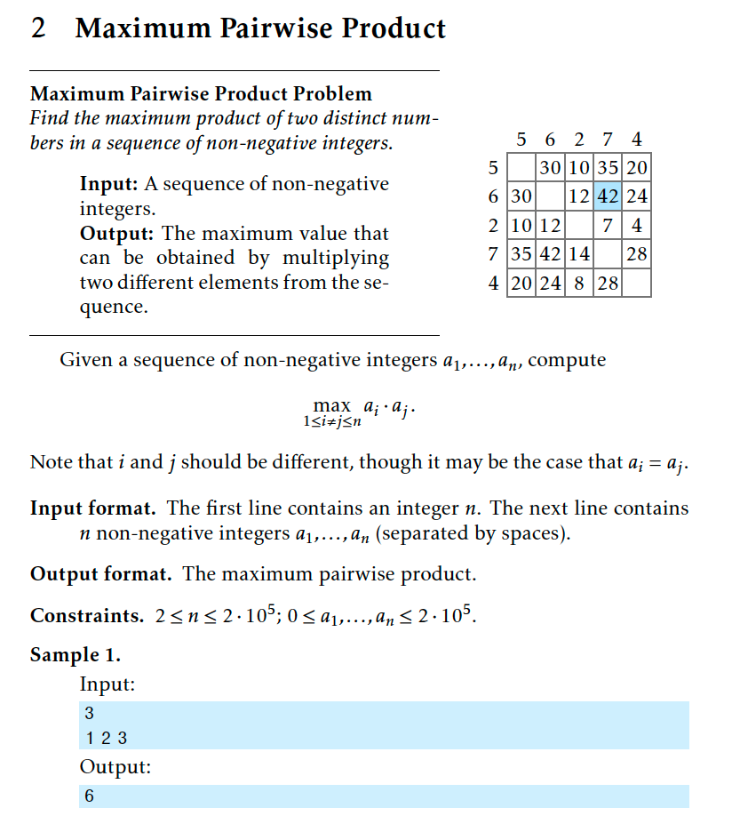

# 2. Maximum Pairwise Product
https://en.wikipedia.org/wiki/Pairwise_comparison

## Problem


## Solutions
* [C](#c)
* [C++](#cpp)
* [Java](#java)
* [Python3](#python3)

### C
```c
    #include <stdio.h>

    typedef long long Type;

    Type find( Type* A, size_t N ){
        size_t i = 0;
        for( size_t j = 1; j < N; ++j )
            if( A[ i ] < A[ j ] )
                i = j;
        Type val = A[ i ];
        A[ i ] = 0; // "remove" (val)ue from A
        return val;
    }

    int main(){
        size_t N = 0;
        scanf( "%d", &N );
        Type A[ N ];
        for( size_t i = 0; i < N; ++i )
            scanf( "%lld", &A[ i ] );
        printf( "%lld", find( A, N ) * find( A, N ) );
        return 0;
    }
```

### CPP
```cpp
    #include <iostream>
    #include <sstream>
    #include <vector>
    #include <algorithm>
    #include <iterator>

    using namespace std;

    template< typename Type >
    class Solution {
    public:

        using Collection = vector< Type >;
        using Iter = istream_iterator< Type >;

        void test( istream& input, ostream& output, Collection A={}, size_t N=0, Type first=0, Type second=0 ){
            input >> N, copy_n( Iter( input ), N, back_inserter( A ));
            auto i = max_element( A.begin(), A.end() ); first  = *i, *i = 0;
            auto j = max_element( A.begin(), A.end() ); second = *j;
            output << first * second << endl;
        }

    };

    int main(){

        using Type = unsigned long long;

        Solution< Type > solution;
        solution.test( cin, cout );

        return 0;
    }
```

### Java
```java
    import java.util.Scanner;
    import java.util.ArrayList;
    import java.util.Collections;

    // TLE
    public class Main {
        public static void main( String[] args ){
            Scanner input = new Scanner( System.in );
            int N = input.nextInt();
            if( N < 2 )
                return;
            ArrayList< Long > A = new ArrayList< Long >( N );
            for( int i = 0; i < N; ++i )
                A.add( input.nextLong() );
            int i = A.indexOf( Collections.max( A ) ); Long first =  A.get( i ); A.set( i, Long.valueOf( 0 ) );
            int j = A.indexOf( Collections.max( A ) ); Long second = A.get( j );
            System.out.println( first * second );
        }
    }
```

### Python3
```python
    if __name__ == '__main__':
        N = input()
        A = list( map( int, input().split() ))
        i = A.index( max( A ))
        first = A[ i ]
        A[ i ] = 0
        j = A.index( max( A ))
        second = A[ j ]
        print( first * second )
```