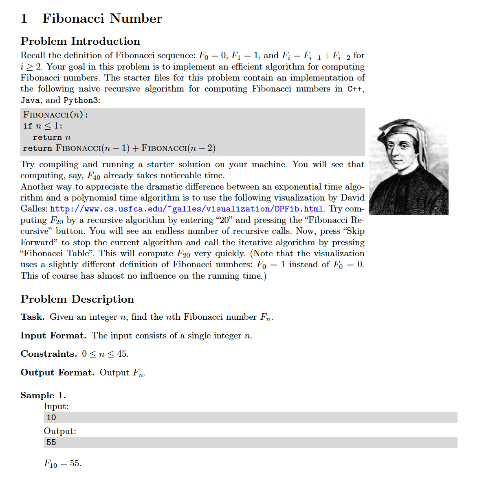

# 1. Fibonacci Number
https://en.wikipedia.org/wiki/Fibonacci_number

## Problem


## Solutions
* [C](#c)
* [C++](#cpp)
* [Java](#java)
* [Python3](#python3)

### C
```c
    #include <stdio.h>
    #include <stdlib.h>
    #include <limits.h>
    #include <assert.h>

    #define TOP_DOWN    69
    #define BOTTOM_UP   96

    typedef int Type;
    typedef Type* HType;
    const Type INF = INT_MAX;


    #ifdef TOP_DOWN

        HType createMemo( Type );
        void destroyMemo();
        Type fibonacci( Type );
        Type go( Type, HType );

        HType createMemo( Type N ){
            HType memo = ( HType ) malloc(( N+1 ) * sizeof( Type ));
            for( int i = 0; i <= N; ++i )
                memo[ i ] = INF;
            return memo;
        }

        void destroyMemo( HType memo ){
            free( memo );
        }

        Type fibonacci_top_down( Type N ){
            HType memo = createMemo( N );
            Type res = go( N, memo );
            destroyMemo( memo );
            return res;
        }

        Type go( Type N, HType memo ){
            if( memo[ N ] != INF )
                return memo[ N ];
            if( N < 2 )
                return memo[ N ] = N;
            return memo[ N ] = go( N-2, memo ) + go( N-1, memo );
        }

    #endif

    #ifdef BOTTOM_UP

        Type fibonacci_bottom_up( Type N ){
            if( N < 2 )
                return N;
            Type dp[ N+1 ];
            dp[ 0 ] = 0;
            dp[ 1 ] = 1;
            for( int i = 2; i <= N; ++i )
                dp[ i ] = dp[ i-2 ] + dp[ i-1 ];
            return dp[ N ];
        }

    #endif


    int main(){
        Type N = 0;
        scanf( "%d", &N );
        Type ans_top_down = fibonacci_top_down( N ),
             ans_bottom_up = fibonacci_bottom_up( N );
        assert( ans_top_down == ans_bottom_up );
        printf( "%d\n", ans_top_down );
        return 0;
    }
```

### CPP
```cpp
    #include <iostream>
    #include <vector>
    #include <limits>
    #include <cassert>

    using namespace std;

    namespace TopDown {

        template< typename Type >
        class Solution {
        public:

            using Memo = vector< Type >;
            const Type INF = numeric_limits< Type >::max();

            Type fibonacci( Type N ){
                Memo memo( N+1, INF );
                return go( N, memo );
            }

        private:

            Type go( Type N, Memo& memo ){
                if( N < 2 )
                    return memo[ N ] = N;
                return memo[ N ] = go( N-2, memo ) + go( N-1, memo );
            }
        };
    }

    namespace BottomUp {

        template< typename Type >
        class Solution {
        public:

            using VT = vector< Type >;

            Type fibonacci( Type N ){
                if( N < 2 )
                    return N;
                VT dp( N+1 );
                dp[ 0 ] = 0;
                dp[ 1 ] = 1;
                for( auto i{ 2 }; i <= N; ++i )
                    dp[ i ] = dp[ i-2 ] + dp[ i-1 ];
                return dp[ N ];
            }
        };
    }

    int main(){
        using Type = int;
        TopDown::Solution< Type > solution_top_down;
        BottomUp::Solution< Type > solution_bottom_up;
        Type N{ 0 };
        cin >> N;
        auto ans_top_down = solution_top_down.fibonacci( N ),
             ans_bottom_up = solution_bottom_up.fibonacci( N );
        assert( ans_top_down == ans_bottom_up );
        cout << ans_top_down;
        return 0;
    }
```

### Java
```java
    import java.util.Scanner;
    import java.util.ArrayList;
    import java.util.Collections;

    public class Main {

        public static Integer INF = Integer.MAX_VALUE;

        public static Integer fibonacci_top_down( Integer N ){
            ArrayList< Integer > memo = new ArrayList< Integer >( Collections.nCopies( N+1, INF ));
            return go( N, memo );
        }

        private static Integer go( Integer N, ArrayList< Integer > memo ){
            if( memo.get( N ) != INF )
                return memo.get( N );
            if( N < 2 ){
                memo.set( N, N );
                return memo.get( N );
            }
            Integer res = go( N-2, memo ) + go( N-1, memo );
            memo.set( N, res );
            return memo.get( N );
        }

        public static Integer fibonacci_bottom_up( Integer N ){
            if( N < 2 )
                return N;
            ArrayList< Integer > dp = new ArrayList< Integer >( Collections.nCopies( N+1, INF ));
            dp.set( 0, 0 );
            dp.set( 1, 1 );
            for( int i = 2; i <= N; ++i )
                dp.set( i, dp.get( i-2 ) + dp.get( i-1 ));
            return dp.get( N );
        }

        public static void main( String[] args ){
            Scanner input = new Scanner( System.in );
            Integer N = input.nextInt();
            Integer ans_top_down = fibonacci_top_down( N ),
                    ans_bottom_up = fibonacci_bottom_up( N );
            assert ans_top_down == ans_bottom_up : "! ( ans_top_down == ans_bottom_up )";
            System.out.println( ans_top_down );
        }
    }
```

### Python3
```python
    INF = 999999999

    def fibonacci_top_down( N ):
        memo = ( N+1 ) * [ INF ]
        return go( N, memo )

    def go( N, memo ):
        if memo[ N ] != INF:
            return memo[ N ]
        if N < 2:
            memo[ N ] = N
        else:        
            memo[ N ] = go( N-2, memo ) + go( N-1, memo )
        return memo[ N ]

    def fibonacci_bottom_up( N ):
        if N < 2:
            return N
        dp = ( N+1 ) * [ INF ]
        dp[ 0 ] = 0
        dp[ 1 ] = 1
        for i in range( 2, N+1 ):
            dp[ i ] = dp[ i-2 ] + dp[ i-1 ]
        return dp[ N ]

    if __name__ == "__main__":
        N = int( input() )
        ans_top_down = fibonacci_top_down( N )
        ans_bottom_up = fibonacci_bottom_up( N )
        assert ans_top_down == ans_bottom_up, "! ( ans_top_down == ans_bottom_up )"
        print( ans_top_down )
```
