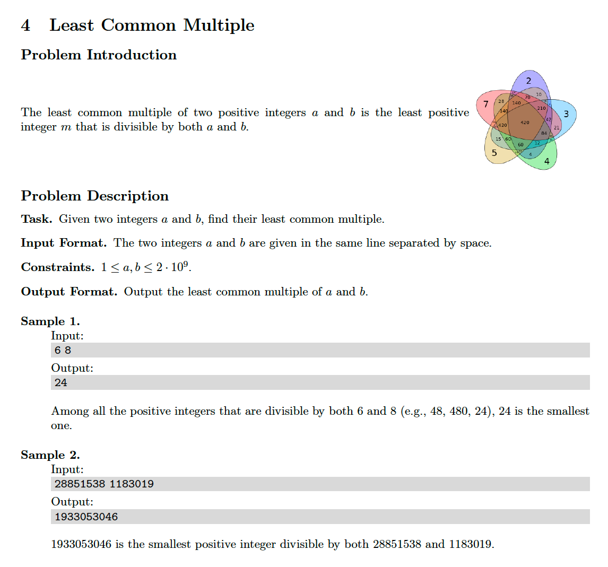

# 4. Least Common Multiple
https://en.wikipedia.org/wiki/Least_common_multiple

## Problem


## Solutions
* [C](#c)
* [C++](#cpp)
* [Java](#java)
* [Python3](#python3)

### C
```c
    #include <stdio.h>

    typedef size_t Type;

    Type gcd( Type a, Type b ){
        for( Type t = 0; b != 0; ){
            t = b;
            b = a % b;
            a = t;
        }
        return a;
    }

    Type lcm( Type a, Type b ){
        return a * b / gcd( a, b );
    }

    int main(){
        Type a = 0,
             b = 0;
        scanf( "%ld %ld", &a, &b );
        Type ans = lcm( a, b );
        printf( "%ld\n", ans );
        return 0;
    }
```

### CPP
```cpp
    #include <iostream>

    using namespace std;

    template< typename Type >
    class Solution {
    public:
                    
        Type gcd( Type a, Type b ){
            for( auto t{ b }; b != 0; ){
                t = b;
                b = a % b;
                a = t;
            }
            return a;
        }
                    
        Type lcm( Type a, Type b ){
            return a * b / gcd( a, b );
        }
    };

    int main(){
        using Type = size_t;
        Solution< Type > solution;
        Type a = 0,
            b = 0;
        cin >> a >> b;
        Type ans = solution.lcm( a, b );
        cout << ans << endl;
        return 0;
    }
```

### Java
```java
    import java.util.Scanner;

    public class Main {

        private static long gcd( long a, long b ){
            for( long t = 0; b != 0; ){
                t = b;
                b = a % b;
                a = t;
            }
            return a;
        }

        private static long lcm( long a, long b ){
            return a * b / gcd( a, b );
        }

        public static void main(String[] args){
            Scanner input = new Scanner( System.in );
            long a = input.nextLong(),
                 b = input.nextLong(),
                 ans = lcm( a, b );
            System.out.println( ans );
        }
    }
```

### Python3
```python
    def gcd( a, b ):
        while b != 0:
            t = b
            b = a % b
            a = t
        return a

    def lcm( a, b ):
        return int( a * b / gcd( a, b ))

    if __name__ == '__main__':
        a, b = map( int, input().split() )
        ans = lcm( a, b )
        print( ans )
```
