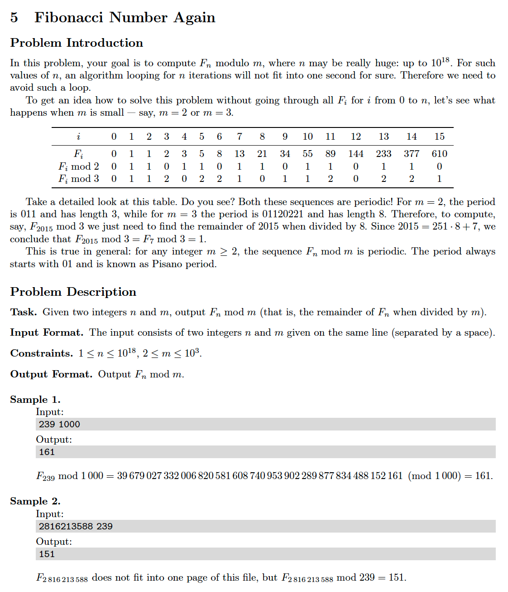

# 5 Fibonacci Number Again
https://en.wikipedia.org/wiki/Pisano_period

## Problem


## Solutions
* [C](#c)
* [C++](#cpp)
* [Java](#java)
* [Python3](#python3)

### C
```c
    #include <stdio.h>

    typedef unsigned long long Type;

    Type fibonacci( Type N, Type M ){
        Type dp[ (6*M)+1 ];
        dp[ 0 ] = 0;
        dp[ 1 ] = 1;
        dp[ 2 ] = 1;
        Type i = 3; // start looking for the pisano period from i=3 to ignore the first 0,1 sequence at dp[ 0 ] and dp[ 1 ]
        for(; i <= N && ! ( dp[ i-2 ] == 0 && dp[ i-1 ] == 1 ); ++i )
            dp[ i ] = ( dp[ i-2 ] + dp[ i-1 ] ) % M;
        Type P = i-2;                    // (P)isano period
        return( N <= i-1 )? dp[ N ]      // case 1) (P)isano period NOT reached, return the N-th fibonacci number
                          : dp[ N % P ]; // case 2) (P)isano period reached, return (N mod P)-th fibonacci number
    }

    int main(){
        Type N = 0,
             M = 0;
        scanf( "%lld %lld", &N, &M );
        Type ans = fibonacci( N, M );
        printf( "%lld", ans );
        return 0;
    }
```

### CPP
```cpp
    #include <iostream>
    #include <vector>

    using namespace std;

    template< typename Type >
    class Solution {
    public:

        using Collection = vector< Type >;

        Type fibonacci( Type N, Type M ){
            Collection dp( (6*M)+1 );
            dp[ 0 ] = 0;
            dp[ 1 ] = 1;
            dp[ 2 ] = 1;
            Type i = 3; // start looking for the pisano period from i=3 to ignore the first 0,1 sequence at dp[ 0 ] and dp[ 1 ]
            for(; i <= N && ! ( dp[ i-2 ] == 0 && dp[ i-1 ] == 1 ); ++i )
                dp[ i ] = ( dp[ i-2 ] + dp[ i-1 ] ) % M;
            Type P = i-2;                    // (P)isano period
            return( N <= i-1 )? dp[ N ]      // case 1) (P)isano period NOT reached, return the N-th fibonacci number
                              : dp[ N % P ]; // case 2) (P)isano period reached, return (N mod P)-th fibonacci number
        }
    };

    int main(){
        using Type = unsigned long long;
        Solution< Type > solution;
        Type N = 0,
             M = 0;
        cin >> N >> M;
        Type ans = solution.fibonacci( N, M );
        cout << ans << endl;
        return 0;
    }
```

### Java
```java
    import java.util.Scanner;
    import java.util.ArrayList;
    import java.util.Collections;
    import static java.lang.Math.toIntExact;

    public class Main {

        private static Long fibonacci( long N, int M ){
            ArrayList< Long > dp = new ArrayList< Long >( Collections.nCopies( (6*M)+1, Long.valueOf( 0 ) ));
            dp.set( 0, Long.valueOf( 0 ));
            dp.set( 1, Long.valueOf( 1 ));
            dp.set( 2, Long.valueOf( 1 ));
            int i = 3;
            for(; i <= N && ! ( dp.get( i-2 ) == 0 && dp.get( i-1 ) == 1 ); ++i )
                dp.set( i, ( dp.get( i-2 ) + dp.get( i-1 ) ) % M );
            int P = i-2;                                      // (P)isano period
            return( N <= i-1 )? dp.get( toIntExact( N ))      // case 1) (P)isano period NOT reached, return the N-th fibonacci number
                              : dp.get( toIntExact( N % P )); // case 2) (P)isano period reached, return (N mod P)-th fibonacci number
        }

        public static void main( String[] args ){
            Scanner input = new Scanner( System.in );
            long N = input.nextLong();
            int  M = input.nextInt();
            long ans = fibonacci( N, M );
            System.out.println( ans );
        }
    }
```

### Python3
```python
    def fibonacci( N, M ):
        dp = ( (6*M)+1 ) * [ 0 ]
        dp[ 0 ] = 0
        dp[ 1 ] = 1
        dp[ 2 ] = 1
        i = 3 # start looking for the pisano period from i=3 to ignore the first 0,1 sequence at dp[ 0 ] and dp[ 1 ]
        while i <= N and not ( dp[ i-2 ] == 0 and dp[ i-1 ] == 1 ):
            dp[ i ] = ( dp[ i-2 ] + dp[ i-1 ] ) % M
            i += 1
        P = i-2 # (P)isano period
        # case 1) (P)isano period NOT reached, return the N-th fibonacci number
        # case 2) (P)isano period reached, return (N mod P)-th fibonacci number
        ans = dp[ N ] if N <= i-1 else dp[ N % P ]
        return ans

    if __name__ == '__main__':
        N, M = map( int, input().split() )
        ans = fibonacci( N, M )
        print( ans )
```
