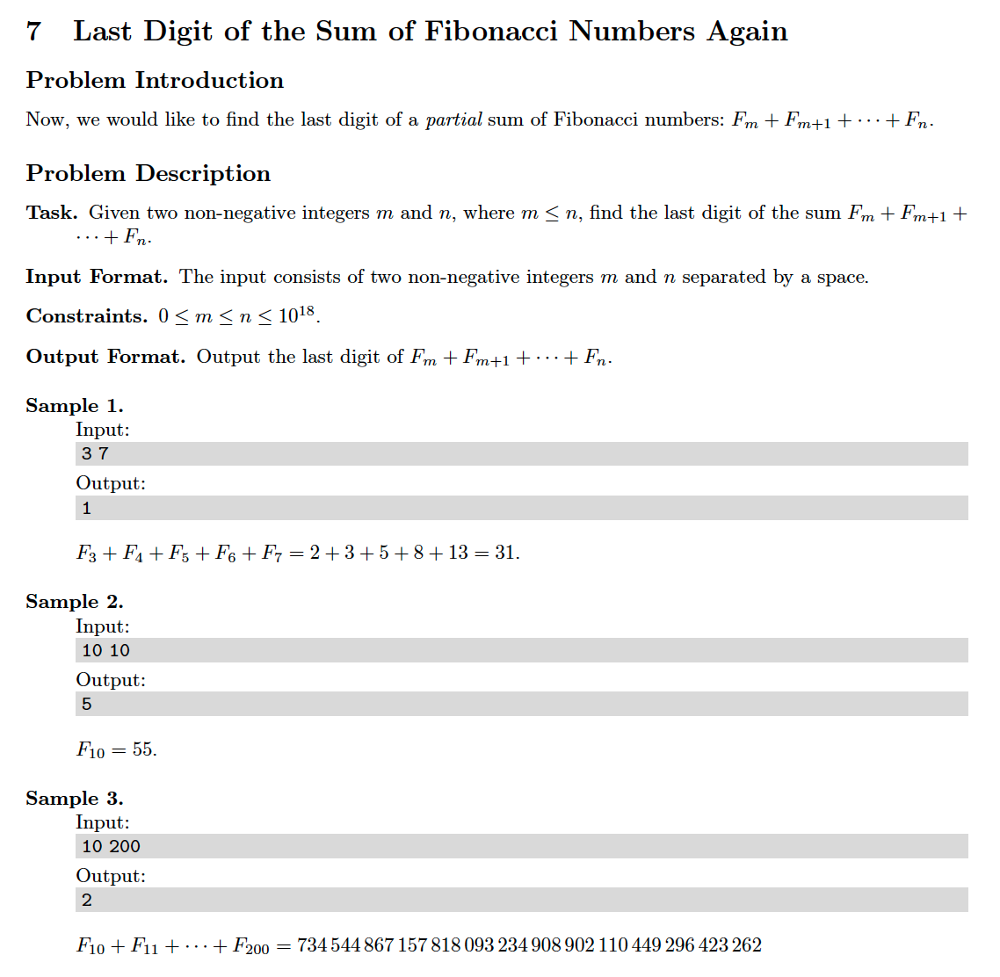

# 7 Last Digit of the Sum of Fibonacci Numbers Again
[https://en.wikipedia.org/wiki/Pisano_period](https://en.wikipedia.org/wiki/Pisano_period)

## Problem


## Solutions
* [C](#c)
* [C++](#cpp)
* [Java](#java)
* [Python3](#python3)

### C
```c
    #include <stdio.h>

    typedef unsigned long long Type;

    Type sum( Type* dp, Type N, Type M, Type L ){
        Type ans = 0;
        for( Type i = L; i <= N; ++i )
            ans += dp[ i ],
            ans %= M;
        return ans;
    }

    Type fibonacci( Type N, Type M, Type L ){
        Type dp[ (6*M)+2 ];
        dp[ 0 ] = 0;
        dp[ 1 ] = 1;
        dp[ 2 ] = 1;
        Type i = 3; // start looking for the pisano period from i=3 to ignore the first 0,1 sequence at dp[ 0 ] and dp[ 1 ]
        for(; i <= N && ! ( dp[ i-2 ] == 0 && dp[ i-1 ] == 1 ); ++i )
            dp[ i ] = ( dp[ i-2 ] + dp[ i-1 ] ) % M;
        Type P = i-2;                                   // (P)isano period
        return( N <= i-1 )? sum( dp, N,     M, L     )  // case 1) (P)isano period NOT reached, return the sum % M of N-th fibonacci number
                          : sum( dp, N % P, M, L % P ); // case 2) (P)isano period reached, return the sum % M of (N mod P)-th fibonacci number
    }

    int main(){
        Type N = 0,
             M = 10,
             L = 0;
        scanf( "%llu %llu", &L, &N );
        Type ans = fibonacci( N, M, L );
        printf( "%llu\n", ans );
        return 0;
    }
```

### CPP
```cpp
    #include <iostream>
    #include <vector>
    #include <numeric>

    using namespace std;

    template< typename Type >
    class Solution {
    public:

        using Collection = vector< Type >;

        Type sum(Collection &dp, Type N, Type M, Type L ){
            return accumulate( dp.begin() + L, dp.begin() + N+1, 0 ) % M;
        }

        Type fibonacci( Type N, Type M, Type L ){
            Collection dp( (6*M)+2, 0 );
            dp[ 0 ] = 0;
            dp[ 1 ] = 1;
            dp[ 2 ] = 1;
            Type i = 3; // start looking for the pisano period from i=3 to ignore the first 0,1 sequence at dp[ 0 ] and dp[ 1 ]
            for(; i <= N && ! ( dp[ i-2 ] == 0 && dp[ i-1 ] == 1 ); ++i )
                dp[ i ] = ( dp[ i-2 ] + dp[ i-1 ] ) % M;
            Type P = i-2;                                   // (P)isano period
            return( N <= i-1 )? sum( dp, N,     M, L     )  // case 1) (P)isano period NOT reached, return the sum % M of N-th fibonacci number
                              : sum( dp, N % P, M, L % P ); // case 2) (P)isano period reached, return the sum % M of (N mod P)-th fibonacci number
        }
    };

    int main(){
        using Type = unsigned long long;
        Solution< Type > solution;
        Type N{ 0 },
             M{ 10 },
             L{ 0 };
        cin >> L >> N;
        Type ans = solution.fibonacci( N, M, L );
        cout << ans << endl;
        return 0;
    }
```

### Java
```java
    import java.util.ArrayList;
    import java.util.Collections;
    import java.util.Scanner;

    public class Main {

        private static long sum( ArrayList< Long > dp, long N, int M, int L ){
            long ans = 0;
            for( int i = L; i <= N; ++i ){
                ans += dp.get( i );
                ans %= M;
            }
            return ans;
        }

        private static long fibonacci( long N, int M, long L ){
            ArrayList< Long > dp = new ArrayList<>( Collections.nCopies( (6*M)+2, Long.valueOf( 0 ) ));
            dp.set( 0, Long.valueOf( 0 ));
            dp.set( 1, Long.valueOf( 1 ));
            dp.set( 2, Long.valueOf( 1 ));
            int i = 3; // start looking for the pisano period from i=3 to ignore the first 0,1 sequence at dp[ 0 ] and dp[ 1 ]
            for(; i <= N && ! ( dp.get( i-2 ) == 0 && dp.get( i-1 ) == 1 ); ++i )
                dp.set( i, ( dp.get( i-2 ) + dp.get( i-1 ) ) % M );
            int P = i-2;                                                   // (P)isano period
            return( N <= i-1 )? sum( dp, N, M, ( int ) L )                 // case 1) (P)isano period NOT reached, return the N-th fibonacci number
                              : sum( dp, N % P, M, ( int )( L % P )); // case 2) (P)isano period reached, return (N mod P)-th fibonacci number
        }

        public static void main( String[] args ){
            Scanner input = new Scanner( System.in );
            int M = 10;
            long L = input.nextLong();
            long N = input.nextLong();
            long ans = fibonacci( N, M, L );
            System.out.println( ans );
        }
    }
```

### Python3
```python
    def sum( dp, N, M, L ):
        ans = 0
        for i in range( L, N+1 ):
            ans += dp[ i ]
            ans %= M
        return ans

    def fibonacci( N, M, L ):
        dp = ( (6*M)+2 ) * [ 0 ]
        dp[ 0 ] = 0
        dp[ 1 ] = 1
        dp[ 2 ] = 1
        i = 3 # start looking for the pisano period from i=3 to ignore the first 0,1 sequence at dp[ 0 ] and dp[ 1 ]
        while i <= N and not ( dp[ i-2 ] == 0 and dp[ i-1 ] == 1 ):
            dp[ i ] = ( dp[ i-2 ] + dp[ i-1 ] ) % M
            i += 1
        P = i-2 # (P)isano period
        # case 1) (P)isano period NOT reached, return the N-th fibonacci number
        # case 2) (P)isano period reached, return (N mod P)-th fibonacci number
        ans = sum( dp, N, M, L ) if N <= i-1 else sum( dp, N % P, M, L % P )
        return ans

    if __name__ == '__main__':
        L, N = map( int, input().split() )
        M = 10
        ans = fibonacci( N, M, L )
        print( ans )
```
