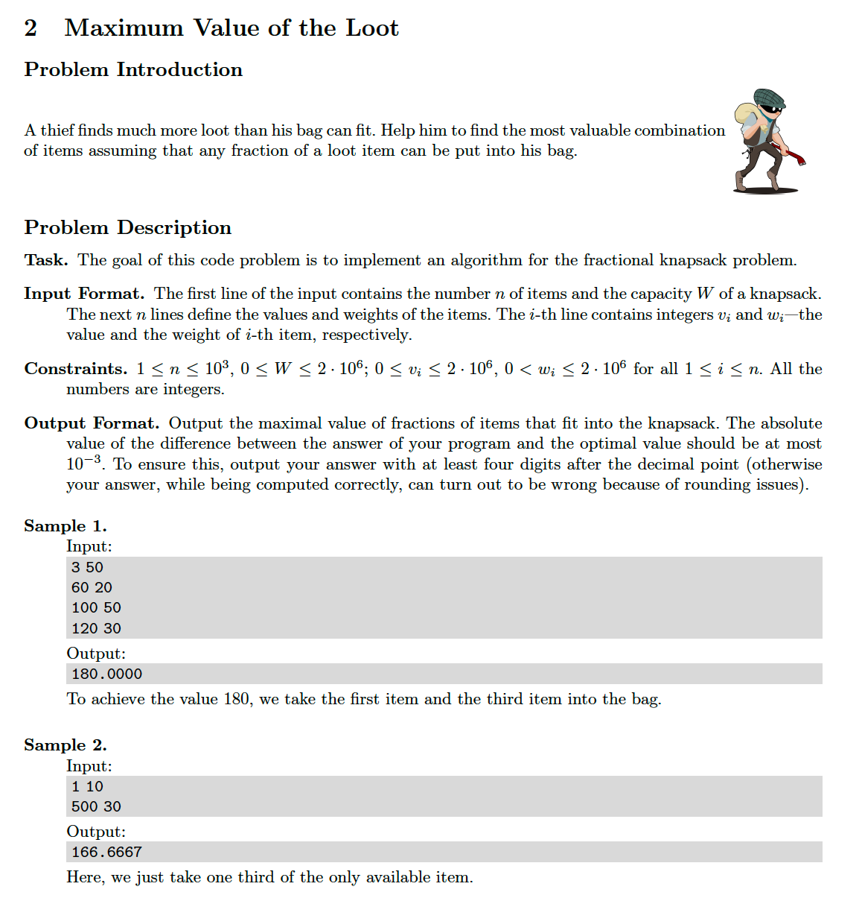

# 2. Maximum Value of the Loot
[https://en.wikipedia.org/wiki/Continuous_knapsack_problem](https://en.wikipedia.org/wiki/Continuous_knapsack_problem)

## Problem


## Solutions
* [C](#c)
* [C++](#cpp)
* [Java](#java)
* [Python3](#python3)

### C
```c
    #include <stdio.h>
    #include <stdlib.h>

    typedef int Type;

    typedef struct {
        Type V, W;
    } Item;

    double ratio( Item item ){
        return( item.W > 0 )? ( double ) item.V / item.W : 0;
    }

    int comparator( const void* lhs, const void* rhs ){
        Item first = *( Item* ) lhs,
             second = *( Item* ) rhs;
        return( ratio( first ) < ratio( second ))?  1
            : ( ratio( first ) > ratio( second ))? -1
            : ( 0 );
    }

    double maxValue( Item* items, Type N, Type W ){
        double ans = 0;
        qsort( items, N, sizeof( Item ), comparator );
        for( int i=0; W > 0 && i < N; ++i ){
            Item item = items[ i ];
            if( item.W <= W ){ // item fits in knapsack
                ans += item.V;
                W -= item.W;
            } else {
                double fraction = ( double ) W / item.W;
                ans += fraction * item.V;
                W = 0;
            }
        }
        return ans;
    }

    int main() {
        Type N = 0,
             W = 0;
        scanf( "%d %d", &N, &W );
        Item items[ N ];
        for( Type i=0, Vi=0, Wi=0; i < N; ++i ){
            scanf( "%d %d", &Vi, &Wi );
            Item item = { .V = Vi, .W = Wi };
            items[ i ] = item;
        }
        double ans = maxValue( items, N, W );
        printf( "%.4lf\n", ans );
        return 0;
    }
```

### CPP
```cpp
    #include <iostream>
    #include <sstream>
    #include <vector>
    #include <iomanip>
    #include <algorithm>

    using namespace std;

    template< typename Type >
    class Solution {
    public:
        struct Item {
            Type V{ 0 },
                 W{ 0 };
            double ratio() const {
                return( W > 0 )? double( V ) / W : 0;
            };
        };
        using Collection = vector< Item >;
        double maxValue( Collection& items, Type W, double ans=0 ){
            sort( items.begin(), items.end(), []( const Item& lhs, const Item& rhs ){ return lhs.ratio() > rhs.ratio(); });
            for( auto& item: items ){
                if( W == 0 )
                    break;
                if( item.W <= W ){ // item fits in knapsack
                    ans += item.V;
                    W -= item.W;
                } else {
                    auto fraction = double( W ) / item.W;
                    ans += fraction * item.V;
                    W = 0;
                }
            }
            return ans;
        }
    };

    int main() {
        using Type = int;
        Solution< Type > solution;
        Solution< Type >::Collection items;
        Type N{ 0 }, // N items
             W{ 0 }; // Weight capacity of knapsack
        cin >> N >> W;
        for( Type Vi{ 0 }, Wi{ 0 }; N--; cin >> Vi >> Wi, items.push_back({ Vi, Wi }) );
        auto ans = solution.maxValue( items, W );
        cout << fixed << setprecision( 4 ) << ans << endl;
        return 0;
    }
```

### Java
```java
    import java.text.DecimalFormat;
    import java.util.Collections;
    import java.util.Scanner;
    import java.util.ArrayList;
    import java.util.Iterator;

    public class Main {

        public static class Item implements Comparable< Item >{
            int V = 0,
                W = 0;
            public Item( int value, int weight ){
                super();
                V = value;
                W = weight;
            }
            public double ratio(){
                return( W > 0 )? ( double ) V  / W : 0;
            }
            public int compareTo( Item rhs ){
                return( ratio() < rhs.ratio() )?  1
                    : ( ratio() > rhs.ratio() )? -1
                    : ( 0 );
            }
        }

        public static double maxValue( ArrayList< Item > items, int W ){
            double ans = 0;
            Collections.sort( items );
            Iterator< Item > it = items.iterator();
            while( W > 0 && it.hasNext() ){
                Item item = it.next();
                if( item.W <= W ){ // item fits in knapsack
                    ans += item.V;
                    W -= item.W;
                } else {
                    double fraction = ( double ) W / item.W;
                    ans += fraction * item.V;
                    W = 0;
                }
            }
            return ans;
        }

        public static void main( String[] args ){
            Scanner input = new Scanner( System.in );
            int N = input.nextInt(),
                W = input.nextInt();
            ArrayList< Item > items = new ArrayList<>( Collections.nCopies( N, new Item( 0, 0 ) ) );
            for( int i=0; i < N; ++i ){
                int Vi = input.nextInt(),
                    Wi = input.nextInt();
                Item item = new Item( Vi, Wi );
                items.set( i, item );
            }
            double ans = maxValue( items, W );
            System.out.println( new DecimalFormat( "#0.0000" ).format( ans ));
        }
    }
```

### Python3
```python
    from typing import List
    from collections import namedtuple

    Item = namedtuple( "Item", "V W" )

    def comparator( item: Item ) -> float:
        return item.V / item.W

    class Solution:
        def maxValue( self, items: List[Item], W: int ) -> float:
            ans = 0
            items.sort( key=comparator, reverse=True )
            for item in items:
                if W == 0:
                    break
                if item.W <= W:
                    ans += item.V
                    W -= item.W
                else:
                    fraction = W / item.W
                    ans += fraction * item.V
                    W = 0
            return ans

    if __name__ == '__main__':
        solution = Solution()
        N, W = map( int, input().split() )
        items = []
        for _ in range( N ):
            Vi, Wi = map( int, input().split() )
            item = Item( Vi, Wi )
            items.append( item )
        ans = solution.maxValue( items, W )
        print( "%.4f" % ans )
```
