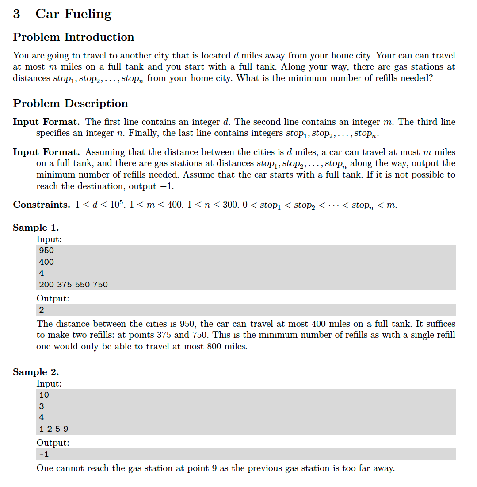

# 3. Car Refueling
[https://en.wikipedia.org/wiki/Greedy_algorithm](https://en.wikipedia.org/wiki/Greedy_algorithm)

## Problem


## Solutions
* [C](#c)
* [C++](#cpp)
* [Java](#java)
* [Python3](#python3)

### C
```c
    #include <stdio.h>

    typedef int Type;
    typedef Type* Collection;

    Type minRefills( Collection S, Type N, Type reach ){
        Type ans = 0,
             T = N-1; // (T)arget index
        for( int i=0, j=i; i < T; i=j ){
            for( j=i; j+1 < N && S[j+1] - S[i] <= reach; ++j ); // increment j to farthest reachable stop
            if( j == i )
                return -1; // ran out of gas
            ans +=( j < T )? 1 : 0;
        }
        return ans;
    }

    int main() {
        Type target = 0,
             reach = 0,
             N = 0;
        scanf( "%d %d %d", &target, &reach, &N );
        N += 2; // +1 for the beginning stop and +1 for the target stop
        Type stops[ N ];
        stops[ 0 ] = 0;
        for( int i=1, stop=0; i+1 < N; scanf( "%d", &stop ), stops[ i++ ]=stop );
        stops[ N-1 ] = target;
        Type ans = minRefills( stops, N, reach );
        printf( "%d\n", ans );
        return 0;
    }
```

### CPP
```cpp
    #include <iostream>
    #include <vector>

    using namespace std;

    template< typename Type >
    class Solution {
    public:
        using Collection = vector< Type >;
        Type minRefills( Collection& S, Type reach, Type ans=0 ){
            auto N = S.size(),
                 T = N-1; // (T)arget index
            for( auto i{ 0 }, j{ i }; i+1 < N; i=j ){
                for( j=i; j+1 < N && S[j+1] - S[i] <= reach; ++j ); // increment j to farthest reachable stop
                if( j == i )
                    return -1; // ran out of gas
                ans +=( j < T )? 1 : 0;
            }
            return ans;
        }
    };

    int main() {
        using Type = int;
        Solution< Type > solution;
        Solution< Type >::Collection stops{ 0 };
        Type target{ 0 }; cin >> target;
        Type reach{ 0 }; cin >> reach;
        Type N{ 0 }; cin >> N;
        for( Type stop{ 0 }; N--; cin >> stop, stops.push_back( stop ));
        stops.push_back( target );
        auto ans = solution.minRefills( stops, reach );
        cout << ans << endl;
        return 0;
    }
```

### Java
```java
    import java.util.Scanner;

    public class Main {

        public static int minRefills( int[] S, int N, int reach ){
            int ans = 0,
                T = N-1; // (T)arget index
            for( int i=0, j=i; i < T; i=j ){
                for( j=i; j+1 < N && S[j+1] - S[i] <= reach; ++j ); // increment j to farthest reachable stop
                if( j == i )
                    return -1; // ran out of gas
                ans +=( j < T )? 1 : 0;
            }
            return ans;
        }

        public static void main( String[] args ){
            Scanner input = new Scanner( System.in );
            int target = input.nextInt(),
                reach = input.nextInt(),
                N = input.nextInt() + 2; // +1 for the beginning stop and +1 for the target stop
            int[] stops = new int[ N ];
            stops[ 0 ] = 0;
            for( int i=1; i+1 < N; ++i ){
                int stop = input.nextInt();
                stops[ i ] = stop;
            }
            stops[ N-1 ] = target;
            int ans = minRefills( stops, N, reach );
            System.out.println( ans );
        }
    }
```

### Python3
```python
    class Solution:
        def minRefills( self, S, N, reach ):
            ans = 0
            i = 0
            T = N-1 # (T)arget index
            while i < T:
                j = i
                while j+1 < N and S[j+1] - S[i] <= reach:
                    j += 1
                if j == i:
                    return -1 # ran out of gas
                ans += 1 if j < T else 0
                i = j
            return ans

    if __name__ == '__main__':
        target = int( input() )
        reach = int( input() )
        N = int( input() ) + 2 # +1 for the beginning stop and +1 for the target stop
        stops = [ 0 ]
        stops.extend( map( int, input().split() ))
        stops.append( target )
        solution = Solution()
        ans = solution.minRefills( stops, N, reach )
        print( ans )
```
