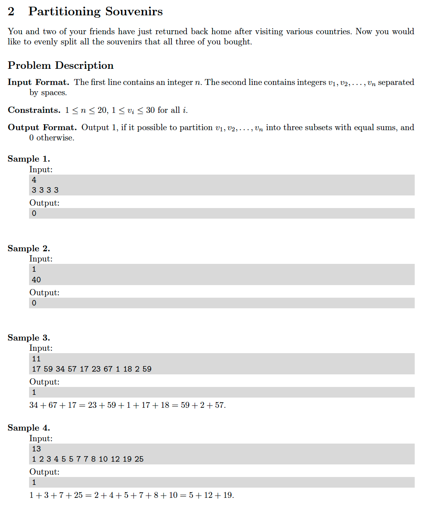

# 2. Partition Souvenirs
* [https://en.wikipedia.org/wiki/Partition_of_a_set](https://en.wikipedia.org/wiki/Partition_of_a_set)

## Problem


## Solutions
* [C++](#cpp)
* [Python3](#python3)

### CPP
```cpp
    #include <iostream>
    #include <sstream>
    #include <iterator>
    #include <algorithm>
    #include <vector>
    #include <numeric>

    using namespace std;

    using VI = vector< int >;

    class Solution {
    public:
        bool canPartition( const VI& A ){
            auto sum = accumulate( A.begin(), A.end(), 0 );
            if( sum % 3 != 0 )
                return false;
            return go( A, sum / 3 );
        }
    private:
        bool go( const VI& A, int T, VI P=VI(3), int i=0 ){ // (A)rray to partition and (T)arget value of each (P)art
            auto N = A.size(), M = P.size();
            if( i == N )
                return P[ 0 ] == T && P[ 1 ] == T && P[ 2 ] == T;
            for( auto j{ 0 }; j < M; ++j ){
                P[ j ] += A[ i ];
                if( P[ j ] <= T && go( A, T, P, i+1 ) )
                    return true;
                P[ j ] -= A[ i ];
            }
            return false;
        }
    };

    int main() {
        auto N{ 0 }; cin >> N;
        VI A;
        copy_n( istream_iterator< int >( cin ), N, back_inserter( A ) );
        Solution solution;
        auto ans = solution.canPartition( A );
        cout << ans << endl;
        return 0;
    }
```

### Python3
```python
    from typing import List

    class Solution:
        def canPartition( self, A: List[int] ) -> bool:
            total = sum( A )
            if total % 3 != 0:
                return False
            return self.go( A, total // 3 )
        def go( self, A: List[int], T: int, P: List[int]=[0,0,0], i: int=0 ) -> bool: # (A)rray to partition and (T)arget value of each (P)art
            if i == len( A ):
                return P[ 0 ] == T and P[ 1 ] == T and P[ 2 ] == T
            for j in range( 0, len( P ) ):
                P[ j ] += A[ i ]
                if P[ j ] <= T and self.go( A, T, P, i+1 ):
                    return True
                P[ j ] -= A[ i ]
            return False

    if __name__ == '__main__':
        N = input()
        A = list( map( int, input().split() ) )
        solution = Solution()
        ans = solution.canPartition( A )
        print( int( ans ) )
```
